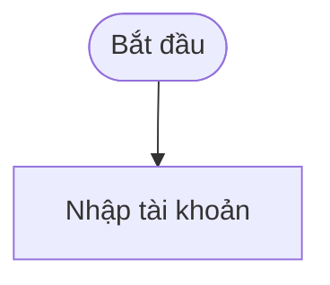
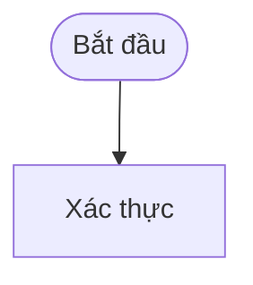
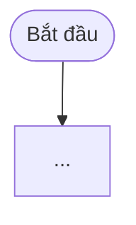
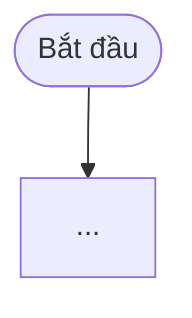

# Đợt 3B-3: khuôn srs.md theo đúng cấu trúc docx thật — Implementation Plan

> **For agentic workers:** REQUIRED SUB-SKILL: Use superpowers:subagent-driven-development (recommended) or superpowers:executing-plans to implement this plan task-by-task. Steps use checkbox (`- [ ]`) syntax for tracking.

**Goal:** Thay khuôn `srs.md` từ I-VI tự đặt sang đúng cấu trúc 4 cấp của tài liệu ban hành thật (Nhóm → Chức năng → Sơ đồ/Mục đích/Mô tả chức năng → Màn hình khi ≥2 → 8 mục a-h), rót đủ dữ liệu §11/§12 giờ đã có, và đổi cơ chế kiểm FN từ ma trận truy vết sang comment ẩn.

**Architecture:** Ba thay đổi phối hợp: (1) `srs_verify.py` bỏ hẳn logic ma trận/`--template`, thay bằng BLOCKING dựa trên `<!-- FN: ... -->` + WARNING kiểm cấu trúc 3 mục Chức năng/8 mục a-h; (2) `srs-template.md` viết lại toàn bộ theo 4 cấp; (3) `srs-from-code.md` viết lại mapping + thêm logic đánh số theo vị trí + hướng dẫn 3 loại mermaid.

**Tech Stack:** Python 3.10 stdlib (`re`, `json`, `argparse`, `pathlib`), pytest — không thêm phụ thuộc.

## Global Constraints

- Bỏ hẳn `# I.`–`# VI.` — `srs.md` chỉ còn cấu trúc `## Nhóm` → `### Chức năng` → `#### Sơ đồ chức năng`/`Mục đích chức năng`/`Mô tả chức năng` → `##### [Tên Màn hình]` (chỉ khi ≥2 màn hình) → `###### a.`-`h.` (LUÔN cấp `######`, dù có hay không có `#####`).
- `<!-- FN: FN-ID, FN-ID... -->` đặt ngay dưới heading Chức năng (`###`) — comment ẩn, không hiện khi xem markdown. Đây là cổng BLOCKING duy nhất thay thế mục V Ma trận truy vết đã bỏ.
- Số thứ tự (`1.`/`2.1.`/`a.`-`h.`) tính theo vị trí xuất hiện khi ghi, không lưu cố định — giống cách `intel_tree.py`'s `compute_paths()` đánh số thư mục theo vị trí trong `children`.
- Bỏ hẳn tham số `--template` (cả trong `srs_verify.py` CLI lẫn `srs-from-code.md`'s `$ARGUMENTS`) — cấu trúc mới mô phỏng đúng MỘT tài liệu ban hành cố định, không còn khái niệm khung khách hàng tuỳ biến.
- Hai mục cấp Nhóm "Sơ đồ các giao thức kết nối giữa các khối"/"Cơ sở dữ liệu" (và "Giao tiếp trong hệ thống" ở đầu tài liệu) **không tự sinh** — đánh dấu bằng comment ẩn `<!-- TODO 3B-4: ... -->`, không lược bỏ âm thầm.
- Mục `f. Thiết kế UX/UI` luôn ghi cố định `_(cần chèn ảnh — không tự sinh)_`.
- 3 mermaid: Sơ đồ chức năng + Thiết kế mô hình nghiệp vụ dựng từ `intel §5`; Mô hình Usecase dựng từ `intel §12`+`§6`, mô phỏng bằng `flowchart` (mermaid không có UML use-case native).
- Mapping mới: §1→FN comment, §2→tên Màn hình, §3/§4→mục `h.`, §5→2 sơ đồ mermaid, §6→mục `a.`/`b.`, §7/§9→mục `h.`, §11→mục `g.`, §12→mục `c.`/`d.`, §10→không rót (giữ nguyên, chỉ dùng cuối để hỏi).
- Không đụng `code-intel.md`/`intel-template.md`/`intel_verify.py`/`intel_tree.py`/`fnlist_tree.py`.

---

## Task 1: `srs_verify.py` — bỏ ma trận/`--template`, thêm gate FN-comment + cấu trúc

**Files:**
- Modify: `speckit-extension/scripts/srs_verify.py` (toàn bộ)
- Modify: `speckit-extension/scripts/tests/test_srs_verify.py` (toàn bộ)

**Interfaces:**
- Consumes: `wanted_functions(tree, root)` (đã có từ 3B-1, KHÔNG đổi).
- Produces: `parse_fn_comments(text: str) -> set[str]` — tập FN-ID trong mọi `<!-- FN: ... -->`.
- Produces: `_sections_at_level(text: str, level: int) -> list[tuple[str, str]]` — `[(tiêu đề, nội dung)]` cho mọi heading đúng `level` dấu `#`, nội dung tới trước heading cùng cấp/cao hơn kế tiếp.
- Produces: `check_fn_coverage(text, wanted) -> list[dict]` (BLOCKING).
- Produces: `check_chuc_nang_structure(text) -> list[dict]` (WARNING).
- Produces: `check_man_hinh_structure(text) -> list[dict]` (WARNING).
- Produces: `verify(srs_text: str, wanted: list[str]) -> dict` — chữ ký MỚI, bỏ tham số `template_text`.
- Produces: CLI `srs_verify.py <srs> --functions <path> --root <FN-ID>` — bỏ `--template`.

- [ ] **Step 1: Viết bộ test mới (thất bại) cho `test_srs_verify.py`**

Thay toàn bộ nội dung file bằng:

```python
import json
import sys
from pathlib import Path

import pytest

import srs_verify as sv

FUNCTIONS_TREE = [
    {"id": "FN-01", "name": "Xác thực", "description": "", "children": [
        {"id": "FN-01-01", "name": "Đăng nhập", "description": "", "children": []},
        {"id": "FN-01-02", "name": "Quên mật khẩu", "description": "", "children": []},
    ]},
    {"id": "FN-02", "name": "Hợp đồng", "description": "", "children": [
        {"id": "FN-02-01", "name": "Danh sách hợp đồng", "description": "", "children": []},
    ]},
]

WANTED = ["FN-01-01", "FN-01-02"]

SRS_OK = """## Đăng ký đăng nhập

### Đăng nhập

<!-- FN: FN-01-01 -->

#### Sơ đồ chức năng



#### Mục đích chức năng

Xác thực danh tính người dùng trước khi cho phép truy cập hệ thống.

#### Mô tả chức năng

###### a. Đối tượng tham gia

Người dùng hệ thống.

###### b. Điều kiện thực hiện

Người dùng đã có tài khoản.

###### c. Mô hình Usecase


###### d. Kịch bản trường hợp sử dụng

Tên Use Case: Đăng nhập

###### e. Thiết kế mô hình nghiệp vụ



###### f. Thiết kế UX/UI

_(cần chèn ảnh — không tự sinh)_

###### g. Mô tả điều khiển

| Tên điều khiển | Mô tả điều khiển |
| --- | --- |
| Textbox "Tên đăng nhập" | Trường bắt buộc. |

###### h. Yêu cầu nghiệp vụ

Khi người dùng nhấn nút đăng nhập, hệ thống kiểm tra thông tin.

### Quên mật khẩu

<!-- FN: FN-01-02 -->

#### Sơ đồ chức năng

#### Mục đích chức năng

Khôi phục quyền truy cập khi người dùng quên mật khẩu.

#### Mô tả chức năng

###### a. Đối tượng tham gia

Người dùng hệ thống.

###### b. Điều kiện thực hiện

Người dùng đã có tài khoản.

###### c. Mô hình Usecase

###### d. Kịch bản trường hợp sử dụng

Tên Use Case: Quên mật khẩu

###### e. Thiết kế mô hình nghiệp vụ

###### f. Thiết kế UX/UI

_(cần chèn ảnh — không tự sinh)_

###### g. Mô tả điều khiển

Không có.

###### h. Yêu cầu nghiệp vụ

Hệ thống gửi email đặt lại mật khẩu.
"""


def test_parse_fn_comments_collects_ids():
    assert sv.parse_fn_comments(SRS_OK) == {"FN-01-01", "FN-01-02"}


def test_parse_fn_comments_handles_multiple_ids_in_one_comment():
    text = "<!-- FN: FN-01-01, FN-01-02 -->"
    assert sv.parse_fn_comments(text) == {"FN-01-01", "FN-01-02"}


def test_check_fn_coverage_clean():
    assert sv.check_fn_coverage(SRS_OK, WANTED) == []


def test_check_fn_coverage_blocking_when_missing():
    srs = SRS_OK.replace("<!-- FN: FN-01-02 -->", "<!-- FN: -->")
    out = sv.check_fn_coverage(srs, WANTED)
    assert any(b["loai"] == "thieu-fn" and "FN-01-02" in b["thong_diep"] for b in out)


def test_clean_document_has_no_blocking():
    r = sv.verify(SRS_OK, WANTED)
    assert r["blocking"] == []


def test_missing_fn_comment_is_blocking():
    srs = SRS_OK.replace("<!-- FN: FN-01-02 -->", "<!-- FN: -->")
    r = sv.verify(srs, WANTED)
    assert any(b["loai"] == "thieu-fn" and "FN-01-02" in b["thong_diep"]
               for b in r["blocking"])


def test_placeholder_is_blocking():
    srs = SRS_OK + "\n[Tên phụ lục]\n"
    r = sv.verify(srs, WANTED)
    assert any(b["loai"] == "placeholder" for b in r["blocking"])


def test_markdown_link_is_not_a_placeholder():
    srs = SRS_OK + "\nXem [tài liệu tham khảo](https://example.com/a).\n"
    r = sv.verify(srs, WANTED)
    assert not any(b["loai"] == "placeholder" for b in r["blocking"])


def test_mermaid_block_is_not_a_placeholder():
    srs = SRS_OK + "\n```mermaid\nflowchart TD\n    B[Nhập thông tin]\n```\n"
    r = sv.verify(srs, WANTED)
    assert not any(b["loai"] == "placeholder" for b in r["blocking"])


def test_inline_code_syntax_example_is_not_a_placeholder():
    srs = SRS_OK + "\n| `A([Bắt đầu])` | `B[Nhập thông tin]` |\n"
    r = sv.verify(srs, WANTED)
    assert r["blocking"] == []


def test_fn_comment_itself_is_not_a_placeholder():
    # <!-- FN: FN-01-01, FN-01-02 --> không có dấu [] nào, nhưng xác nhận comment
    # HTML ẩn nói chung (bất kỳ nội dung nào) không lẫn vào placeholder detection.
    srs = SRS_OK + "\n<!-- ghi chú nội bộ [không phải placeholder] -->\n"
    r = sv.verify(srs, WANTED)
    assert not any(b["loai"] == "placeholder" for b in r["blocking"])


def test_empty_wanted_list_warns():
    r = sv.verify(SRS_OK, [])
    assert any(w["loai"] == "pham-vi-rong" for w in r["warnings"])


def test_check_chuc_nang_structure_clean():
    assert sv.check_chuc_nang_structure(SRS_OK) == []


def test_check_chuc_nang_structure_warns_when_missing_muc():
    srs = SRS_OK.replace("#### Mục đích chức năng\n\nXác thực danh tính người dùng "
                          "trước khi cho phép truy cập hệ thống.\n\n", "")
    out = sv.check_chuc_nang_structure(srs)
    assert any(w["loai"] == "chuc-nang-thieu-muc" and "Đăng nhập" in w["thong_diep"]
               and "Mục đích chức năng" in w["thong_diep"] for w in out)


def test_check_man_hinh_structure_clean():
    assert sv.check_man_hinh_structure(SRS_OK) == []


def test_check_man_hinh_structure_warns_when_missing_letter():
    srs = SRS_OK.replace(
        "###### g. Mô tả điều khiển\n\n| Tên điều khiển | Mô tả điều khiển |\n"
        "| --- | --- |\n| Textbox \"Tên đăng nhập\" | Trường bắt buộc. |\n\n", "")
    out = sv.check_man_hinh_structure(srs)
    assert any(w["loai"] == "man-hinh-thieu-muc" and "Đăng nhập" in w["thong_diep"]
               and "g. Mô tả điều khiển" in w["thong_diep"] for w in out)


def test_check_man_hinh_structure_ignores_missing_optional_mermaid():
    # SRS_OK cố ý bỏ trống mermaid ở "Quên mật khẩu" (c./e. không có khối mermaid,
    # vẫn giữ heading) -- không được coi là thiếu mục, vì heading vẫn có mặt.
    out = sv.check_man_hinh_structure(SRS_OK)
    assert not any("Quên mật khẩu" in w["thong_diep"] for w in out)


def test_code_path_is_warning_not_blocking():
    srs = SRS_OK + "\nHành vi nằm ở src/auth/login.ts:42.\n"
    r = sv.verify(srs, WANTED)
    assert r["blocking"] == []
    assert any(w["loai"] == "nghi-duong-dan-code" for w in r["warnings"])


def test_empty_section_is_warning_only():
    srs = SRS_OK + "\n###### i. Mục thừa\n\n"
    r = sv.verify(srs, WANTED)
    assert r["blocking"] == []
    assert any(w["loai"] == "muc-rong" for w in r["warnings"])


def _run(tmp_path, srs_text, root="FN-01"):
    import subprocess
    srs = tmp_path / "srs.md"
    srs.write_text(srs_text, encoding="utf-8")
    fns = tmp_path / "functions.json"
    fns.write_text(json.dumps({"functions": FUNCTIONS_TREE}, ensure_ascii=False),
                   encoding="utf-8")
    script = Path(sv.__file__)
    return subprocess.run(
        [sys.executable, str(script), str(srs), "--functions", str(fns),
         "--root", root],
        capture_output=True, text=True, encoding="utf-8")


def test_cli_exits_zero_when_only_warnings(tmp_path):
    p = _run(tmp_path, SRS_OK + "\nXem src/auth/login.ts:42.\n")
    assert p.returncode == 0, p.stderr
    assert json.loads(p.stdout)["warnings"]


def test_cli_exits_one_when_blocking(tmp_path):
    srs = SRS_OK.replace("<!-- FN: FN-01-02 -->", "<!-- FN: -->")
    p = _run(tmp_path, srs)
    assert p.returncode == 1
    assert json.loads(p.stdout)["blocking"]


def test_cli_empty_root_covers_whole_tree(tmp_path):
    p = _run(tmp_path, SRS_OK, root="")
    assert p.returncode == 1
    assert any(b["loai"] == "thieu-fn" and "FN-02-01" in b["thong_diep"]
               for b in json.loads(p.stdout)["blocking"])


def test_cli_reports_unknown_root(tmp_path):
    p = _run(tmp_path, SRS_OK, root="FN-99")
    assert p.returncode != 0
    assert "FN-99" in p.stderr


def test_cli_has_no_template_flag(tmp_path):
    import subprocess
    srs = tmp_path / "srs.md"
    srs.write_text(SRS_OK, encoding="utf-8")
    fns = tmp_path / "functions.json"
    fns.write_text(json.dumps({"functions": FUNCTIONS_TREE}, ensure_ascii=False),
                   encoding="utf-8")
    script = Path(sv.__file__)
    p = subprocess.run(
        [sys.executable, str(script), str(srs), "--functions", str(fns),
         "--root", "FN-01", "--template", "nope.md"],
        capture_output=True, text=True, encoding="utf-8")
    assert p.returncode != 0
    assert "unrecognized arguments" in p.stderr or "unrecognized arguments" in p.stdout
```

- [ ] **Step 2: Chạy test, xác nhận thất bại**

Run: `python -m pytest speckit-extension/scripts/tests/test_srs_verify.py -v` (dùng
`/c/Python/Python310/python.exe -m pytest ...` nếu `python`/`python3` không có trên PATH)
Expected: FAIL hàng loạt — `AttributeError: module 'srs_verify' has no attribute
'parse_fn_comments'` và tương tự cho các hàm mới; `TypeError` ở mọi lời gọi `sv.verify(srs,
WANTED)` (chữ ký cũ nhận thêm `template_text`).

- [ ] **Step 3: Viết lại toàn bộ `srs_verify.py`**

Thay toàn bộ nội dung file bằng:

```python
#!/usr/bin/env python3
"""Chấm .specify/docs/<đường-dẫn-cây>/srs.md trước khi báo xong.

Hai mức:
  BLOCKING (exit 1) — chỉ thứ kiểm được TẤT ĐỊNH: FN-ID trong phạm vi thiếu
                      mặt trong mọi <!-- FN: ... -->, và placeholder [...] còn sót.
  WARNING  (exit 0) — thứ cần phán đoán: Chức năng/Màn hình thiếu mục con, chuỗi
                      trông giống đường dẫn code, mục rỗng. In ra để người soát.

Tài liệu mô phỏng đúng cấu trúc 4 cấp của bản ban hành thật (Nhóm > Chức năng >
Sơ đồ/Mục đích/Mô tả chức năng > Màn hình khi ≥2 > a.-h.) — không còn khuôn I-VI
tự đặt trước đây, nên không còn "ma trận truy vết" hay "--template" khách hàng để
đối chiếu. FN-ID được kiểm qua comment ẩn <!-- FN: ... --> thay cho ma trận.

Chỉ cần python3 + fnlist_tree (cùng thư mục scripts/), không phụ thuộc ngoài
stdlib.
"""
from __future__ import annotations

import argparse
import json
import re
import sys
from pathlib import Path

import fnlist_tree as ft


def _force_utf8_console() -> None:
    """Windows mở subprocess với stdout/stderr mã cp1252 mặc định, không phải
    UTF-8 — in tiếng Việt có dấu ra đó là crash UnicodeEncodeError. Ép lại UTF-8
    khi có thể; capsys của pytest thay stdout bằng đối tượng không có
    `reconfigure` nên phải hasattr trước."""
    for name in ("stdout", "stderr"):
        stream = getattr(sys, name, None)
        enc = getattr(stream, "encoding", None)
        if enc and enc.lower() != "utf-8" and hasattr(stream, "reconfigure"):
            stream.reconfigure(encoding="utf-8", errors="replace")


_force_utf8_console()

FN_ID_RE = re.compile(r"\bFN(?:-\d{2})+\b")
FN_COMMENT_RE = re.compile(r"<!--\s*FN:(.*?)-->", re.S)
COMMENT_RE = re.compile(r"<!--.*?-->", re.S)
FENCE_RE = re.compile(r"^[ \t]*```.*?^[ \t]*```", re.S | re.M)
INLINE_CODE_RE = re.compile(r"`[^`\n]+`")
PLACEHOLDER_RE = re.compile(r"\[([^\[\]\n]{1,80})\](?!\()")
CHECKBOX_RE = re.compile(r"^[ x]$")
CODE_PATH_RE = re.compile(
    r"\b[\w.-]+/[\w./-]*\.\w{1,5}\b"
    r"|\b\w[\w.-]*\.(?:py|ts|tsx|js|jsx|java|cs|go|rb|php|vue|sql|kt|swift|yml|yaml)\b(?::\d+)?"
)
HEADING_RE = re.compile(r"^(#{1,6})\s+(.+)$")

LETTER_ITEMS = [
    "a. Đối tượng tham gia", "b. Điều kiện thực hiện", "c. Mô hình Usecase",
    "d. Kịch bản trường hợp sử dụng", "e. Thiết kế mô hình nghiệp vụ",
    "f. Thiết kế UX/UI", "g. Mô tả điều khiển", "h. Yêu cầu nghiệp vụ",
]
CHUC_NANG_MUC = ["Sơ đồ chức năng", "Mục đích chức năng", "Mô tả chức năng"]


def strip_noise(text: str) -> str:
    """Bỏ HTML comment, khối code rào, và inline code. Cả ba chứa dấu [] hợp lệ:
    comment là hướng dẫn của khung, khối mermaid dùng B[Nhập thông tin], và bảng
    ký hiệu mermaid tự viết cú pháp trong inline code — không lọc inline code thì
    chính khung ban hành cũng không bao giờ qua được cổng của chính nó."""
    text = FENCE_RE.sub(lambda m: "\n" * m.group(0).count("\n"), text)
    text = COMMENT_RE.sub(lambda m: "\n" * m.group(0).count("\n"), text)
    text = INLINE_CODE_RE.sub("", text)
    return text


def find_placeholders(text: str) -> list[dict]:
    out = []
    for i, line in enumerate(strip_noise(text).splitlines(), start=1):
        for m in PLACEHOLDER_RE.finditer(line):
            inner = m.group(1)
            if CHECKBOX_RE.match(inner):
                continue
            out.append({"line": i, "text": m.group(0)})
    return out


def parse_fn_comments(text: str) -> set[str]:
    """Tập FN-ID trong mọi `<!-- FN: FN-ID, FN-ID... -->` — đọc trên TEXT GỐC
    (chưa strip_noise), vì strip_noise xoá sạch mọi HTML comment. Đây là cơ chế
    thay thế ma trận truy vết cũ: mỗi Chức năng mang một comment ẩn liệt kê FN-ID
    nó phủ, không hiện khi xem tài liệu."""
    ids: set[str] = set()
    for m in FN_COMMENT_RE.finditer(text):
        ids.update(FN_ID_RE.findall(m.group(1)))
    return ids


def _sections_at_level(text: str, level: int) -> list[tuple[str, str]]:
    """[(tiêu đề, nội dung)] cho mọi heading đúng `level` dấu `#`, nội dung tới
    trước heading cùng cấp hoặc cao hơn (ít dấu `#` hơn) kế tiếp. Hàm tổng quát
    thay cho các parser ad-hoc theo số mục "## N." cũ — khuôn mới đặt tên mục
    bằng chữ (Chức năng, Màn hình, a.-h.), không còn đánh số cố định để bám vào."""
    src = strip_noise(text)
    lines = src.splitlines()
    marks = []
    for i, ln in enumerate(lines):
        m = HEADING_RE.match(ln.strip())
        if m:
            marks.append((i, len(m.group(1)), m.group(2).strip()))
    out = []
    for idx, (i, lvl, title) in enumerate(marks):
        if lvl != level:
            continue
        end = len(lines)
        for j in range(idx + 1, len(marks)):
            if marks[j][1] <= level:
                end = marks[j][0]
                break
        out.append((title, "\n".join(lines[i + 1:end])))
    return out


def wanted_functions(tree: list[dict], root: str) -> list[str]:
    """FN-ID lá thuộc nhánh `root` trong cây functions.json — `root` rỗng
    nghĩa là toàn cây."""
    if not root and not tree:
        return []
    if root:
        node = ft.find_by_id(tree, root)
        if node is None:
            raise ValueError(f"Không có {root} trong cây functions.")
    else:
        node = {"children": tree}
    return [n["id"] for n in ft.subtree_leaves(node)]


def check_fn_coverage(text: str, wanted: list[str]) -> list[dict]:
    """Mọi FN trong phạm vi phải xuất hiện trong ít nhất một
    `<!-- FN: ... -->` — thay thế hoàn toàn vai trò `thieu-fn` của ma trận truy
    vết cũ."""
    covered = parse_fn_comments(text)
    missing = [f for f in wanted if f not in covered]
    if not missing:
        return []
    return [{
        "loai": "thieu-fn",
        "thong_diep": "Thiếu FN-ID trong mọi <!-- FN: ... --> của tài liệu: "
                      + ", ".join(missing),
        "goi_y": "Thêm FN-ID đó vào comment <!-- FN: ... --> của Chức năng tương ứng.",
    }]


def check_chuc_nang_structure(text: str) -> list[dict]:
    """Mỗi Chức năng (`###`) phải có đủ 3 mục con Sơ đồ chức năng/Mục đích chức
    năng/Mô tả chức năng — WARNING vì Sơ đồ chức năng hợp lệ để rỗng (không có
    luồng §5), chỉ heading thiếu hẳn mới đáng cảnh báo."""
    out = []
    for cn_title, cn_body in _sections_at_level(text, 3):
        have = {t for t, _ in _sections_at_level(cn_body, 4)}
        missing = [m for m in CHUC_NANG_MUC if m not in have]
        if missing:
            out.append({
                "loai": "chuc-nang-thieu-muc",
                "thong_diep": f"Chức năng '{cn_title}' thiếu mục: " + ", ".join(missing),
            })
    return out


def check_man_hinh_structure(text: str) -> list[dict]:
    """Trong mỗi 'Mô tả chức năng' của một Chức năng, cả 8 mục a.-h. phải có mặt
    Ở ĐÂU ĐÓ trong toàn bộ mục đó — kiểm gộp theo Chức năng, KHÔNG tách riêng
    từng Màn hình (khuôn cho phép 1 Chức năng có nhiều Màn hình, mỗi màn hình có
    heading `#####` riêng hoặc không có heading riêng khi chỉ 1 màn hình; tách
    đúng theo từng màn hình đòi một parser phức tạp hơn nhiều cho một gate chỉ ở
    mức WARNING — chấp nhận: nếu Chức năng có 2 màn hình mà một màn hình thiếu
    mục X còn màn hình kia có mục X, gate này không phát hiện được, chỉ bắt ca
    thiếu mục X ở TẤT CẢ màn hình của Chức năng đó)."""
    out = []
    for cn_title, cn_body in _sections_at_level(text, 3):
        for mt_title, mt_body in _sections_at_level(cn_body, 4):
            if mt_title != "Mô tả chức năng":
                continue
            have = {t for t, _ in _sections_at_level(mt_body, 6)}
            missing = [it for it in LETTER_ITEMS if it not in have]
            if missing:
                out.append({
                    "loai": "man-hinh-thieu-muc",
                    "thong_diep": f"Chức năng '{cn_title}': thiếu mục "
                                  + ", ".join(missing)
                                  + " (có thể thiếu ở một hoặc nhiều màn hình).",
                })
    return out


def _empty_sections(text: str) -> list[dict]:
    lines = strip_noise(text).splitlines()
    heads = [(i, ln) for i, ln in enumerate(lines) if re.match(r"^#{1,6}\s+\S", ln.strip())]
    out = []
    for n, (i, ln) in enumerate(heads):
        end = heads[n + 1][0] if n + 1 < len(heads) else len(lines)
        body = "".join(x.strip() for x in lines[i + 1:end])
        if not body.replace("-", "").strip():
            out.append({"line": i + 1, "text": ln.strip()})
    return out


def verify(srs_text: str, wanted: list[str]) -> dict:
    blocking, warnings = [], []

    blocking.extend(check_fn_coverage(srs_text, wanted))

    if not wanted:
        warnings.append({
            "loai": "pham-vi-rong",
            "thong_diep": "Không có chức năng lá nào trong phạm vi đang kiểm.",
        })

    for ph in find_placeholders(srs_text):
        blocking.append({
            "loai": "placeholder",
            "thong_diep": f"Còn placeholder ở dòng {ph['line']}: {ph['text']}",
            "goi_y": "Điền nội dung, ghi 'Không có', hoặc xoá cả mục con.",
        })

    warnings.extend(check_chuc_nang_structure(srs_text))
    warnings.extend(check_man_hinh_structure(srs_text))

    for i, line in enumerate(strip_noise(srs_text).splitlines(), start=1):
        for m in CODE_PATH_RE.finditer(line):
            warnings.append({
                "loai": "nghi-duong-dan-code",
                "thong_diep": f"Dòng {i} có chuỗi trông giống đường dẫn code: {m.group(0)}",
                "goi_y": "Tài liệu giao khách nên không nêu đường dẫn mã nguồn. "
                         "Nếu đây là tên file nghiệp vụ hợp lệ thì bỏ qua cảnh báo này.",
            })

    warnings.extend({"loai": "muc-rong",
                     "thong_diep": f"Mục rỗng ở dòng {e['line']}: {e['text']}"}
                    for e in _empty_sections(srs_text))

    return {"blocking": blocking, "warnings": warnings}


def main(argv=None):
    p = argparse.ArgumentParser(description="Chấm srs.md trước khi báo xong")
    p.add_argument("srs", help="Đường dẫn .specify/docs/<đường-dẫn-cây>/srs.md")
    p.add_argument("--functions", default=".specify/docs/functions.json")
    p.add_argument("--root", default="",
                   help="FN-ID gốc của phạm vi; rỗng = toàn cây")
    a = p.parse_args(argv)

    srs = Path(a.srs).read_text(encoding="utf-8")
    doc = json.loads(Path(a.functions).read_text(encoding="utf-8"))
    tree = doc.get("functions") or []
    try:
        wanted = wanted_functions(tree, a.root)
    except ValueError as e:
        raise SystemExit(str(e))

    report = verify(srs, wanted)
    print(json.dumps(report, ensure_ascii=False, indent=2))
    n_b, n_w = len(report["blocking"]), len(report["warnings"])
    print(f"\n{n_b} lỗi chặn, {n_w} cảnh báo.", file=sys.stderr)
    if n_b:
        raise SystemExit(1)


if __name__ == "__main__":
    main()
```

- [ ] **Step 4: Chạy lại test, xác nhận toàn bộ pass**

Run: `python -m pytest speckit-extension/scripts/tests/test_srs_verify.py -v`
Expected: PASS toàn bộ (24 test).

- [ ] **Step 5: Commit**

```bash
git add speckit-extension/scripts/srs_verify.py speckit-extension/scripts/tests/test_srs_verify.py
git commit -m "feat(code-intel): srs_verify.py sang gate FN-comment + cấu trúc 4 cấp (đợt 3B-3)"
```

---

## Task 2: `srs-template.md` — viết lại theo 4 cấp docx thật

**Files:**
- Modify: `speckit-extension/templates/srs-template.md` (toàn bộ)

**Interfaces:**
- Produces: cấu trúc mà Task 1 (`_sections_at_level`, `LETTER_ITEMS`, `CHUC_NANG_MUC`) và
  Task 3 (`srs-from-code.md`'s hướng dẫn rót) phải khớp chính xác — heading `## [Tên Nhóm]`,
  `### [Tên Chức năng]`, `<!-- FN: ... -->` ngay dưới, `#### Sơ đồ chức năng`/`Mục đích
  chức năng`/`Mô tả chức năng`, `##### [Tên Màn hình]` (tuỳ chọn), `###### a.`-`h.` (đúng
  8 nhãn, đúng chính tả từng chữ trong `LETTER_ITEMS` của Task 1).

Đây là file scaffold (không phải code) — không có bước TDD. Bước kiểm tra là đọc lại và
chạy `srs_verify.py` (Task 1) trên chính khung này để xác nhận không tự gây blocking giả.

- [ ] **Step 1: Viết lại toàn bộ `srs-template.md`**

Thay toàn bộ nội dung file bằng:

````markdown
<!-- KHUNG MẶC ĐỊNH — mô phỏng đúng cấu trúc tài liệu ban hành thật của công ty (docx),
     KHÔNG còn khuôn I-VI tự đặt trước đây. 4 cấp lồng nhau:

       ## Nhóm
         ### Chức năng
           #### Sơ đồ chức năng / Mục đích chức năng / Mô tả chức năng
             ##### [Tên Màn hình]   (CHỈ có khi Chức năng có ≥2 màn hình)
               ###### a.-h.  (8 mục cố định, LUÔN ở cấp `######` dù có hay không có `#####`)

     Số thứ tự (1./2.1./a.-h.) tính theo VỊ TRÍ xuất hiện khi ghi, không lưu cố định — xem
     hướng dẫn đánh số ở srs-from-code.md. Khung này (file mẫu) không tự đánh số, vì đây
     chỉ là một Nhóm/Chức năng mẫu duy nhất, không phải toàn tài liệu.

     `<!-- FN: FN-ID, FN-ID... -->` đặt ngay dưới heading Chức năng — comment ẩn, KHÔNG
     hiện khi xem markdown/xuất Word, chỉ srs_verify.py đọc để đối chiếu functions.json.
     Đây là cổng BLOCKING duy nhất còn lại — mọi FN trong phạm vi phải có mặt ở ít nhất
     một comment.

     Không để sót placeholder [...]: điền, hoặc dùng đúng placeholder cố định
     "_(cần chèn ảnh — không tự sinh)_" cho mục f (không phải placeholder ngoặc vuông,
     srs_verify.py không coi cụm này là placeholder chưa điền).

     Tài liệu này GIAO KHÁCH — không nêu file:dòng, tên class/hàm, đường dẫn mã nguồn.
     Bằng chứng file:dòng ở lại intel.md cùng thư mục. -->

## [Tên Nhóm]

<!-- TODO 3B-4: Sơ đồ các giao thức kết nối giữa các khối, Cơ sở dữ liệu — chưa tự sinh, cần đợt sau -->

### [Tên Chức năng]

<!-- FN: [FN-ID, FN-ID...] -->

#### Sơ đồ chức năng

<!-- Chỉ dựng khi intel §5 có luồng tổng quan cho chính Chức năng này. Không có -> xoá cả
     khối mermaid mẫu dưới đây (kể cả heading "#### Sơ đồ chức năng" nếu muốn, nhưng giữ
     heading để srs_verify.py không cảnh báo "thiếu mục" cũng được — heading rỗng chỉ bị
     cảnh báo WARNING "muc-rong", không BLOCKING). -->



#### Mục đích chức năng

[1 câu, văn phong Hán-Việt trang trọng nêu giá trị/lý do nghiệp vụ — không mô tả thao tác.]

#### Mô tả chức năng

##### [Tên Màn hình]

<!-- Heading "##### [Tên Màn hình]" CHỈ xuất hiện khi Chức năng có ≥2 màn hình. Đúng 1
     màn hình (trùng tên Chức năng) -> XOÁ heading này, nối thẳng a.-h. ngay dưới
     "#### Mô tả chức năng" (a.-h. vẫn giữ nguyên cấp `######`). -->

###### a. Đối tượng tham gia

[Vai trò/đối tượng tham gia màn hình này.]

###### b. Điều kiện thực hiện

[Điều kiện để truy cập/thực hiện màn hình này.]

###### c. Mô hình Usecase

<!-- mermaid flowchart mô phỏng actor-usecase (mermaid không có UML use-case native),
     dựng từ intel §12 + §6. Không có dữ liệu -> xoá cả khối mermaid. -->


###### d. Kịch bản trường hợp sử dụng

Tên Use Case: [...]

Mức quan trọng: Chưa có thông tin

Người dùng: [...]

Loại UC: Chưa có thông tin

Người sử dụng và yêu cầu: [...]

Mô tả tóm tắt: [...]

Thời điểm sử dụng: Chưa có thông tin

Luồng sự kiện chuẩn:

1. [bước]

Luồng sự kiện nhỏ:

S-1: [tên nhánh]

[bước]

###### e. Thiết kế mô hình nghiệp vụ

<!-- mermaid flowchart chi tiết luồng riêng màn hình này (nêu rõ thành phần nào xử lý
     bước nào), dựng từ intel §5. Không có -> xoá cả khối mermaid. -->



###### f. Thiết kế UX/UI

_(cần chèn ảnh — không tự sinh)_

###### g. Mô tả điều khiển

| Tên điều khiển | Mô tả điều khiển |
| --- | --- |
| [Loại] "[nhãn]" | [hình thức + vị trí hiển thị. Ràng buộc ngắn gọn nếu có. Hành vi/mục đích khi tương tác.] |

###### h. Yêu cầu nghiệp vụ

[Câu ghép điều kiện → kết quả — "Khi người dùng ..., hệ thống ..., đồng thời ...".]
````

- [ ] **Step 2: Đọc lại toàn văn, xác nhận đúng 4 cấp**

Run:
```bash
grep -n "^## \|^### \|^#### \|^##### \|^###### " speckit-extension/templates/srs-template.md
```
Expected: đúng 1 dòng `## `, 1 dòng `### `, 3 dòng `#### ` (Sơ đồ chức năng, Mục đích chức
năng, Mô tả chức năng), 1 dòng `##### `, 8 dòng `###### ` (a. tới h., đúng thứ tự).

- [ ] **Step 3: Chạy `srs_verify.py` trên chính khung mẫu, xác nhận không tự gây blocking giả**

```bash
mkdir -p /tmp/srs-template-smoke
cat > /tmp/srs-template-smoke/functions.json <<'EOF'
{"functions": []}
EOF
python /e/agent-skills/speckit-extension/scripts/srs_verify.py \
  speckit-extension/templates/srs-template.md \
  --functions /tmp/srs-template-smoke/functions.json --root ""
rm -rf /tmp/srs-template-smoke
```

Expected: chạy không crash (khung mẫu chứa placeholder `[...]` thật nên `blocking` SẼ khác
rỗng và mã thoát SẼ là 1 — đây là kỳ vọng đúng, khung mẫu chưa điền nội dung thật; điều
cần xác nhận là script CHẠY ĐƯỢC không lỗi cú pháp/parse trên chính file mẫu, không phải
kỳ vọng `blocking` rỗng).

- [ ] **Step 4: Commit**

```bash
git add speckit-extension/templates/srs-template.md
git commit -m "feat(code-intel): srs-template.md theo đúng 4 cấp cấu trúc docx thật (đợt 3B-3)"
```

---

## Task 3: `srs-from-code.md` — viết lại mapping + đánh số + 3 loại mermaid

**Files:**
- Modify: `speckit-extension/commands/srs-from-code.md` (toàn bộ)

**Interfaces:**
- Consumes: `srs_verify.py <srs> --functions <path> --root <FN-ID>` (Task 1, không còn
  `--template`).
- Consumes: cấu trúc `srs-template.md` (Task 2) — heading `## Nhóm`/`### Chức năng`/`####
  Sơ đồ chức năng`/`Mục đích chức năng`/`Mô tả chức năng`/`##### [Tên Màn hình]`/`######
  a.`-`h.`, `<!-- FN: ... -->`.
- Consumes: `intel_tree.py propose`/`units` (đã có, không sửa), `fnlist_import.py update`
  (đã có, không sửa).

Đây là file prompt/instruction — không có bước TDD. Bước kiểm tra là đọc lại và chạy thử
`srs_verify.py` trên một `srs.md` mẫu dựng theo đúng hướng dẫn.

- [ ] **Step 1: Viết lại toàn bộ nội dung file**

Thay toàn bộ nội dung `speckit-extension/commands/srs-from-code.md` bằng:

````markdown
---
description: Sinh .specify/docs/<đường-dẫn-cây>/srs.md theo đúng cấu trúc 4 cấp của tài liệu ban hành thật (Nhóm→Chức năng→Sơ đồ/Mục đích/Mô tả chức năng→Màn hình→a.-h.) từ intel.md và functions.json — nhận một FN-ID gốc (trống = toàn dự án), tái dùng intel_tree.py để đề xuất/xác nhận unit rồi sinh SRS theo batch (song song/tuần tự), chỉ ghi nội dung phản ánh đúng những gì code thật sự làm, thông tin hành chính thiếu thì ghi "Chưa có thông tin", và tổng hợp một lượt cuối cùng những phát hiện logic/bảo mật đáng chú ý để hỏi người dùng.
---

# SRS từ code intel theo cây functions.json

Rót `.specify/docs/<đường-dẫn-cây>/intel.md` (tài liệu nội bộ, kèm nguồn `file:dòng`)
thành **`.specify/docs/<đường-dẫn-cây>/srs.md`** — tài liệu **giao khách**, đúng cấu trúc
4 cấp của tài liệu ban hành thật (`Nhóm → Chức năng → Sơ đồ/Mục đích/Mô tả chức năng →
Màn hình → a.-h.`), không lộ đường dẫn mã nguồn. Toàn bộ tiếng Việt. Dùng `python3` nếu
`python` không có.

**Tài liệu này tập trung vào source code** — mô tả đúng những gì hệ thống *thật sự làm*
theo `intel.md`, không phải một bản diễn giải nghiệp vụ suy đoán. Hai loại thông tin xử
lý khác nhau:

- **Thông tin hành chính/nghiệp vụ thuần mà code không thể tiết lộ** (mức quan trọng use
  case, loại UC theo quy ước BA, thời điểm sử dụng, chính sách kinh doanh chỉ người mới
  biết…) → ghi thẳng "Chưa có thông tin" trong tài liệu, không đánh dấu gì đặc biệt,
  không dừng lại hỏi. Cuối báo cáo chỉ nhắc gọn một dòng — bổ sung nếu cần, không phải
  một cuộc trao đổi.
- **Phát hiện đáng chú ý khi đọc code** — logic mâu thuẫn, xung đột giữa các phần code,
  dấu hiệu lỗ hổng bảo mật (đã được `code-intel` ghi vào `intel §10`) → đây mới là thứ
  đáng dừng lại. Tổng hợp **một lượt** ở cuối, hỏi người dùng: cố ý thiết kế vậy hay là
  bug. **Không ghi vào `srs.md`** — tài liệu giao khách không nêu loại phát hiện này.

## User Input

`$ARGUMENTS`

Kỳ vọng: **trống, hoặc một FN-ID** — giống hệt `code-intel`:

- Trống → điểm bắt đầu là **gốc cây** — chọn unit trong toàn bộ dự án.
- `FN-01` → chỉ xét unit trong nhánh đó.
- Một FN-ID lá → đúng một unit (chính nó).

Không còn khái niệm "tên cụm gõ tay" hay "`--template` khách hàng" — thư mục sinh ra tự
động từ cấu trúc `functions.json`, và khuôn `srs.md` mô phỏng đúng MỘT cấu trúc tài liệu
ban hành cố định (không còn khung tuỳ biến theo khách).

## Validate cứng trước khi làm bất cứ gì khác

- **`.specify/docs/functions.json` không tồn tại** → DỪNG, nhắc chạy
  `/speckit.dft-speckit.fnlist-import` trước.
- **`$ARGUMENTS` không trống và không khớp `^FN(?:-\d{2})+$`** → DỪNG, in cú pháp hợp lệ
  (`FN-01`, `FN-01-01`, …), hỏi lại. Không tự đoán/tự sửa.
- **FN-ID đúng cú pháp nhưng không có trong cây** → chạy
  `python .../scripts/intel_tree.py units --functions .specify/docs/functions.json --roots <FN-ID>`
  sẽ tự báo lỗi kèm đúng FN-ID không tìm thấy — DỪNG, in nguyên thông điệp, không tự đoán
  ID gần đúng.

## Quy trình (bắt buộc theo thứ tự)

Đường dẫn script: `.specify/extensions/dft-speckit/scripts/`. Dùng `python3` nếu
`python` không có (macOS/Linux).

### 1. Đề xuất unit + xác nhận cây

```bash
python .specify/extensions/dft-speckit/scripts/intel_tree.py propose \
  --functions .specify/docs/functions.json [--start <FN-ID nếu có>]
```

In ra danh sách unit đề xuất (mặc định: node có tất cả con đều là lá, hoặc node không
có con đứng một mình) kèm cây thụt lề có đánh dấu `[UNIT]`. Trình nguyên văn cây này cho
người dùng qua AskUserQuestion: xác nhận đúng ranh giới, hay muốn gộp/tách lại?

- Điều chỉnh hợp lệ: chọn một tập node KHÁC làm root của unit (sâu hơn hoặc cao hơn đề
  xuất), miễn mỗi root vẫn là một nhánh cây hợp lệ (không lẫn hai node không phải anh em
  vào cùng một unit — điều đó không được hỗ trợ).
- Chưa có phản hồi → DỪNG, không sang bước 2.
- Có điều chỉnh → dùng danh sách root người dùng chốt (không phải danh sách đề xuất mặc
  định) cho bước 2.
- Sau khi người dùng chốt danh sách root, kiểm: không root nào là tổ tiên hoặc hậu duệ
  của root khác trong **cùng danh sách** (nếu có, một FN sẽ lọt vào hai unit chồng lấn).
  Phát hiện vi phạm → DỪNG, chỉ rõ cặp root lồng nhau, hỏi lại người dùng chọn lại.

### 2. Tính đường dẫn `srs.md` + kiểm `intel.md` đã có chưa

```bash
python .specify/extensions/dft-speckit/scripts/intel_tree.py units \
  --functions .specify/docs/functions.json --roots <FN-ID,FN-ID,...>
```

Với mỗi unit trả về, `path` là đường dẫn FILE `intel.md` (đã có sẵn hậu tố `/intel.md`),
TƯƠNG ĐỐI so với `.specify/docs/`. Suy đường dẫn `srs.md` của unit bằng cách **thay hậu
tố**: `path.replace("/intel.md", "/srs.md")` — cùng thư mục với `intel.md`, không gọi lại
`intel_tree.py` với tham số khác, không viết logic suy path mới.

Với mỗi unit đã chốt, kiểm sự tồn tại của `.specify/docs/<path unit>` (đường dẫn `intel.md`
thật, `.specify/docs/` + `path`):

- **`intel.md` tồn tại** → đưa vào danh sách **runnable**, tiếp tục.
- **`intel.md` không tồn tại**:
  - Tổng số unit đã chốt ở bước 1 là **đúng 1** → **DỪNG NGAY**, nhắc chạy
    `/speckit.dft-speckit.code-intel <FN-ID gốc của unit>` trước. Không tạo `srs.md`.
  - Tổng số unit đã chốt **≥ 2** → **bỏ qua** unit đó, ghi lại vào danh sách **đã bỏ qua**
    (FN-ID + tên), tiếp tục xét các unit còn lại — không dừng cả batch.

Danh sách **runnable** rỗng sau khi lọc (mọi unit ≥2 đều thiếu `intel.md`) → **DỪNG**,
in toàn bộ danh sách "đã bỏ qua", nhắc chạy `code-intel` trước cho các unit đó.

### 3. Chạy song song hay tuần tự?

Danh sách **runnable** có **≥ 2 unit** → hỏi qua AskUserQuestion: chạy song song (mỗi
unit một subagent độc lập qua Agent tool) hay tuần tự (xử từng unit một). **Đúng 1 unit
runnable** → chạy thẳng bước 4-11 dưới đây, không hỏi.

Chạy song song: dispatch một Agent riêng cho mỗi unit runnable, giao FN-ID gốc của unit,
đường dẫn `srs.md` đã suy ở bước 2, đường dẫn `intel.md` tương ứng, danh sách FN-ID kèm
status (từ bước 2), và yêu cầu subagent đọc lại chính file lệnh này
(`.specify/extensions/dft-speckit/commands/srs-from-code.md`) rồi thực hiện đúng Bước
4–11 dưới đây cho một unit đó. Không đồng bộ giữa các subagent — hai unit dùng chung một
entity có thể diễn giải khác nhau, chấp nhận là giới hạn đã biết (giống hệt `code-intel`).

Subagent **không tự gọi** `fnlist_import.py update` ở Bước 10 của chính nó. Thay vào đó,
sau khi Bước 9 (verify) pass sạch, subagent **báo cáo lại** cho agent cha danh sách cặp
`FN-ID=srs` cần cập nhật (không tự ghi) — tránh race: nhiều subagent cùng ghi đè
`functions.json` sẽ làm mất cập nhật của nhau. Agent cha đợi **tất cả** subagent hoàn
tất, gom toàn bộ cặp `FN-ID=srs` từ mọi subagent, rồi gọi `fnlist_import.py update`
**đúng một lần** với đầy đủ các `--set`.

Cùng lúc báo cáo cặp `FN-ID=srs`, subagent **cũng báo cáo lại** — không tự trình bày,
không tự hỏi người dùng — danh sách các dòng `intel §10` đang `đang chờ` của unit mình
(mô tả + nguồn `file:dòng` + đường dẫn `intel.md`): subagent không có lượt tương tác
tiếp theo của riêng nó để nhận câu trả lời, nên không thể tự hỏi rồi tự ghi ngược
`intel.md` §10 như luồng tuần tự làm (xem bước 11 phần 2). Agent cha gom các danh sách
này từ mọi subagent, gộp vào ĐÚNG MỘT lượt hỏi người dùng ở cuối, rồi tự ghi ngược
`intel.md` §10 theo từng unit sau khi có câu trả lời.

Chạy tuần tự: lặp qua từng unit runnable, thực hiện Bước 4–11 cho unit đó xong mới sang
unit kế.

### 4. Kiểm `srs.md` đã tồn tại chưa (làm TRƯỚC khi rót/viết/ghi bất cứ gì)

**Chỗ duy nhất trong lệnh này ghi vào `.specify/docs/<đường-dẫn-cây>/srs.md` là bước 8
"Điền khung".** Mục này chỉ đọc và ghi nhớ, không ghi gì cả — nhưng phải làm trước các
bước 5–7, vì luật no-clobber dưới đây phải có trong đầu **trước khi** bước 8 chạm vào
file, không phải đọc ra sau khi đã ghi đè mất bản cũ.

`srs.md` **chưa tồn tại** → không có gì phải giữ, đi tiếp bước 5.

`srs.md` **đã tồn tại** → đọc toàn bộ nội dung hiện tại, ghi nhớ luật sẽ áp ở bước 8:
mọi nội dung người dùng/BA đã sửa tay ở bất kỳ mục nào (kể cả những mục trước đây ghi
"Chưa có thông tin" mà nay đã có nội dung thật) sẽ **giữ nguyên**, chỉ cập nhật mục nào
có nội dung khác đi khi so trực tiếp bản `srs.md` hiện có với `intel.md`/`functions.json`
hiện tại — so theo NỘI DUNG từng khối Chức năng/Màn hình, không có mốc thời gian/hash để
so "đã đổi từ lần chạy trước" một cách trừu tượng. Khuôn mới không còn mục `I.1` lịch sử
thay đổi dạng bảng (bỏ cùng toàn bộ khuôn I-VI) — no-clobber chỉ còn ở mức nội dung, không
còn dòng lịch sử riêng để ghi thêm.

### 5. Rót phần suy được từ intel

Đọc `intel.md` của unit và `functions.json`. Ánh xạ mục — không tự ý đổi hướng, mục nào
trong `intel.md` không có thì mục `srs.md` tương ứng cũng không có gì để rót:

| Nguồn (`intel.md`) | Đích (`srs.md`) |
| --- | --- |
| §1 Phủ chức năng | `<!-- FN: ... -->` dưới mỗi Chức năng |
| §2 Màn hình / điểm vào | Tên Màn hình (`##### [Tên Màn hình]` khi ≥2 màn hình); câu mở đầu "Mô tả chức năng" |
| §3 Thực thể và trường dữ liệu | rải vào mục `h. Yêu cầu nghiệp vụ` |
| §4 Kiểm tra hợp lệ và quy tắc nghiệp vụ | rải vào mục `h. Yêu cầu nghiệp vụ` |
| §5 Luồng nghiệp vụ | mermaid ở `#### Sơ đồ chức năng` (tổng quan) và `###### e. Thiết kế mô hình nghiệp vụ` (chi tiết từng màn hình) |
| §6 Phân quyền | mục `a. Đối tượng tham gia`, `b. Điều kiện thực hiện` |
| §7 Tích hợp ngoài, tác vụ nền, sự kiện | rải vào mục `h. Yêu cầu nghiệp vụ` |
| §9 Thông báo hiển thị | rải vào mục `h. Yêu cầu nghiệp vụ` |
| §11 Điều khiển giao diện | mục `g. Mô tả điều khiển` (bảng Tên điều khiển/Mô tả điều khiển, khớp cột `Màn hình` của §11 với tên Màn hình đang viết) |
| §12 Kịch bản Use Case | mục `d. Kịch bản trường hợp sử dụng` (9 field nguyên văn, khớp cột `Màn hình` của §12) + mục `c. Mô hình Usecase` (mermaid, dựng từ Tên Use Case + Người dùng của §12) |
| §10 Phát hiện logic/bảo mật | **Không rót vào `srs.md`** — chỉ dùng ở bước 11 để hỏi người dùng |

**Ba field của §12 luôn ghi cố định "Chưa có thông tin" khi rót sang `d. Kịch bản trường
hợp sử dụng`**: `Mức quan trọng`, `Loại UC`, `Thời điểm sử dụng` — đây là phân loại
nghiệp vụ thuần, `intel §12` (theo đúng thiết kế của nó) cũng luôn ghi "Chưa có thông
tin" cho ba field này, rót nguyên văn sang, không tự suy đoán giá trị khác.

**Hai mục cấp Nhóm không có nguồn trong `intel.md` — KHÔNG tự sinh, đánh dấu comment ẩn
thay vì lược bỏ âm thầm**: "Sơ đồ các giao thức kết nối giữa các khối" và "Cơ sở dữ liệu"
(mỗi Nhóm), và "Giao tiếp trong hệ thống" (một lần đầu tài liệu, nếu sinh từ gốc cây).
Với mỗi Nhóm, thêm ngay dưới heading Nhóm:

```markdown
<!-- TODO 3B-4: Sơ đồ các giao thức kết nối giữa các khối, Cơ sở dữ liệu — chưa tự sinh, cần đợt sau -->
```

Không tự suy nội dung cho ba mục này từ bất kỳ nguồn nào — không có `§N` nào của
`intel.md` là nguồn hợp lệ cho kiến trúc hệ thống/schema DB.

**Sơ đồ mermaid — ba loại, ba quy ước riêng, đều tuân kỷ luật "không sơ đồ bịa"**:

- **`#### Sơ đồ chức năng`**: `flowchart` tổng quan gộp mọi màn hình con của Chức năng,
  dựng từ `intel §5`. `§5` không có luồng nào ứng với Chức năng này → xoá cả khối mermaid
  (giữ heading, để trống — WARNING `muc-rong` không chặn).
- **`###### e. Thiết kế mô hình nghiệp vụ`**: `flowchart` chi tiết CHỈ riêng màn hình đang
  viết, nêu rõ thành phần nào xử lý bước nào (đúng như `§5` đã ghi). `§5` không có luồng
  cho màn hình này → xoá cả khối mermaid.
- **`###### c. Mô hình Usecase`**: mermaid không có UML use-case native — mô phỏng bằng
  `flowchart` (actor = node chữ nhật `A([Tên actor])`, use case = node oval
  `UC([Tên Use Case])`, cạnh nối actor→use case). Dữ liệu từ `intel §12` (trường
  `Người dùng` → actor, `Tên Use Case` → use case). `§12` không có khối `###` nào ứng với
  màn hình này → xoá cả khối mermaid.

**`###### f. Thiết kế UX/UI`**: luôn ghi cố định `_(cần chèn ảnh — không tự sinh)_` — không
bao giờ tự vẽ mockup hay mô tả bố cục màn hình (`intel.md` không quét bố cục UI).

### 6. Chuyển hoá bắt buộc khi rót

> `intel.md` là tài liệu nội bộ, `srs.md` giao khách. Khi rót sang: **bỏ hết
> `file:dòng`, tên class, tên hàm, đường dẫn mã nguồn**. Nội dung mang dấu `(suy đoán)` ở
> intel vẫn phản ánh đúng thứ code làm (đó là suy luận có căn cứ, chỉ chưa chắc 100%) —
> rót bình thường vào `srs.md`, không cần đánh dấu gì thêm (tài liệu này không phải chỗ
> để lộ mức độ tự tin nội bộ).

`intel §9` không có nguyên văn thông báo (câu hỏi đã bị đưa xuống `intel §8` vì không tìm
được nguồn) → mục `h. Yêu cầu nghiệp vụ` viết mô tả **ý nghĩa** của thông báo dựa trên
`intel §5`/`§4` (hành vi hệ thống khi tình huống đó xảy ra), không bịa nguyên văn giả.

Văn phong rót giữ nguyên toàn bộ quy ước đã chốt ở spec đợt 3B-1 §6:

- **`Mục đích chức năng`**: đúng 1 câu, văn phong Hán-Việt trang trọng, nêu giá trị/lý do
  nghiệp vụ ("giúp...", "nhằm...", "đảm bảo..."), không mô tả thao tác.
- **`d. Kịch bản trường hợp sử dụng`**: `Mô tả tóm tắt` là một đoạn văn liền mạch tóm toàn
  luồng bằng các mệnh đề nối dấu phẩy. `Luồng sự kiện chuẩn` đánh số bước `1:`, `2:`…;
  nhánh rẽ trong bước đánh `S-1:`, `S-2:`… gọi tên bằng cụm trong ngoặc kép; `Luồng sự
  kiện nhỏ` khai triển lại đúng các nhãn `S-n` đó theo thứ tự.
- **`g. Mô tả điều khiển`**: cột `Tên điều khiển` viết dạng `[Loại] "[nhãn hiển thị đúng
  nguyên văn trên UI]"`. Cột `Mô tả điều khiển` 2-3 câu tách dòng riêng theo thứ tự: (1)
  hình thức + vị trí hiển thị, (2) ràng buộc ngắn gọn nếu có (câu độc lập "Trường bắt
  buộc."), (3) hành vi/mục đích khi tương tác.
- **`h. Yêu cầu nghiệp vụ`**: câu ghép "Khi người dùng [hành động], hệ thống [phản ứng],
  đồng thời [phản ứng phụ]" hoặc "nếu… thì…, ngược lại…" — nêu rõ điều kiện kích hoạt
  trước kết quả.
- Chủ ngữ nhất quán: "Hệ thống" khi mô tả xử lý phía sau, "Người dùng" khi mô tả thao
  tác. Không lẫn thuật ngữ code/kỹ thuật vào các mục này.

### 7. Điền phần còn lại — chỉ ghi thứ chắc chắn

Không dùng AskUserQuestion ở bước này.

- **Mọi câu chưa có trả lời ở `intel §8`** (chính sách nghiệp vụ thuần, không phải phát
  hiện logic/bảo mật của §10): không chèn vào `srs.md`. Gom lại, đưa vào mục "Thông tin
  còn thiếu" ở báo cáo cuối bước 11 — một dòng mỗi câu, ngắn gọn.
- Nội dung mô tả hệ thống viết từ dữ kiện `intel.md`/`functions.json` sẵn có, phản ánh
  đúng những gì code làm — không tự thêm diễn giải "giá trị nghiệp vụ" khi không có căn
  cứ, nêu đúng những gì hệ thống làm, không suy luận vì sao nó làm vậy.

### 8. Điền khung — đánh số theo vị trí, ghi FN comment

Đây là bước duy nhất ghi vào `srs.md`. Áp đúng luật no-clobber đã ghi nhớ ở bước 4 nếu
file đã tồn tại từ trước.

- **Đánh số `1.`/`2.1.`/`a.`-`h.` theo VỊ TRÍ XUẤT HIỆN khi ghi** — Nhóm đầu tiên là `1.`,
  Chức năng đầu tiên trong Nhóm là `<số Nhóm>.1`, tiếp tục tăng dần. Chữ cái `a.`-`h.` LUÔN
  cố định thứ tự (không phụ thuộc vị trí, đây là 8 mục có tên riêng, không phải danh sách
  đếm). Không lưu số cố định giữa các lần chạy — chạy lại tự tính lại theo cấu trúc hiện
  tại, giống cách `intel_tree.py`'s `compute_paths()` đánh số thư mục theo vị trí trong
  `children`.
- **`##### [Tên Màn hình]` chỉ giữ khi Chức năng có ≥2 màn hình** — đúng 1 màn hình (trùng
  tên Chức năng) thì XOÁ heading này, nối thẳng `a.`-`h.` (vẫn giữ cấp `######`) vào ngay
  dưới `#### Mô tả chức năng`.
- **`<!-- FN: FN-ID, FN-ID... -->` ngay dưới heading Chức năng** — liệt kê MỌI FN-ID lá mà
  Chức năng đó phủ (lấy từ `intel §1`, đối chiếu `intel §2` xem FN nào gắn với màn hình
  nào thuộc Chức năng này). Đây là cổng BLOCKING duy nhất còn lại (thay ma trận truy vết
  cũ) — thiếu một FN trong comment này là tài liệu chưa xong, `srs_verify.py` ở bước 9 sẽ
  chặn.
- **Mọi Nhóm/Chức năng phải có mặt trong `srs.md`** — không được lược bỏ Chức năng nào chỉ
  vì nội dung ít; Chức năng chưa tìm thấy code (`intel §1` ghi "không tìm thấy") vẫn viết
  một khối Chức năng, các mục a.-h. ghi "Chưa có thông tin" thay vì bịa, KHÔNG có khái
  niệm "Ngoài phạm vi" nào để bỏ qua hẳn Chức năng đó (khuôn docx không có mục dạng ma
  trận truy vết để khai "Ngoài phạm vi" nữa — mọi FN trong phạm vi đều phải xuất hiện
  trong `<!-- FN: ... -->` của MỘT Chức năng nào đó, dù nội dung còn sơ sài).

### 9. Cổng cuối — chạy trước khi báo xong

```bash
python .specify/extensions/dft-speckit/scripts/srs_verify.py \
  .specify/docs/<đường-dẫn-cây>/srs.md \
  --functions .specify/docs/functions.json \
  --root <FN-ID gốc của unit>
```

Đọc JSON trả về, có hai khoá `blocking` và `warnings`.

- **`blocking` khác rỗng (mã thoát ≠ 0) → cấm báo xong.** Với mục có `goi_y` (`thieu-fn`,
  `placeholder`), sửa theo đúng gợi ý đó. `thieu-fn` nghĩa là một FN-ID chưa xuất hiện
  trong bất kỳ `<!-- FN: ... -->` nào — kiểm lại khối Chức năng tương ứng đã có comment
  đúng chưa, không phải "thêm một dòng ma trận cho có" như khuôn cũ (khuôn này không còn
  ma trận). Sửa xong, **chạy lại script** — không tự cho là đã sửa đúng mà không xác nhận
  lại bằng cách chạy thật.
- **`warnings` khác rỗng (mã thoát vẫn 0) → không phải lỗi, nhưng phải trình bày NGAY
  TẠI ĐÂY cho người dùng**, trước khi làm bước 10. `chuc-nang-thieu-muc`/`man-hinh-thieu-
  muc` nghĩa là một Chức năng/Màn hình thiếu heading con bắt buộc — xem lại có phải bỏ sót
  thật hay chỉ là nội dung để trống hợp lệ (vd không có luồng §5 cho mermaid). `nghi-
  duong-dan-code` có thể là báo nhầm (tên file nghiệp vụ hợp lệ trong mô tả); chọn "đây là
  báo nhầm" thì phải nêu đích danh từng chuỗi + lý do cụ thể. Không được im lặng bỏ qua
  bất kỳ warning nào.

### 10. Ghi ngược trạng thái

**Chạy tuần tự** (hoặc chạy đơn 1 unit runnable): gọi `update` ngay sau mỗi unit, sau khi
đã trình bày xong `warnings` ở bước 9 — không cập nhật trạng thái trước khi người dùng có
cơ hội thấy những gì còn cần soát. **Chạy song song**: **không** gọi ở đây — xem hướng
dẫn gom về agent cha ở bước 3.

Mọi FN thuộc unit đã xuất hiện trong ít nhất một `<!-- FN: ... -->` → đặt trạng thái `srs`:

```bash
python .specify/extensions/dft-speckit/scripts/fnlist_import.py update \
  --file .specify/docs/functions.json --set FN-01-01=srs [--set FN-01-02=srs ...]
```

Gọi thẳng, không cần xác nhận riêng — `update` tự validate toàn bộ ID trước khi ghi.

### 11. Kết thúc — tổng hợp một lượt, không chèn rải rác trong lúc sinh

Với mỗi unit, báo theo đúng ba phần dưới, tách bạch rõ mức độ quan trọng — đừng trộn
chung thành một danh sách phẳng:

1. **Số liệu**: đường dẫn `srs.md`, số Nhóm/Chức năng đã đặc tả, và **dán nguyên văn dòng
   tổng kết `N lỗi chặn, M cảnh báo.`** của lần chạy `srs_verify.py` **cuối cùng** (bằng
   chứng đã thực sự chạy, không phải tự thuật lại bằng lời).

2. **Phát hiện cần bạn xác nhận** — chỉ liệt kê các mục `intel §10` có cột `Kết luận` =
   `đang chờ` (mục đã có kết luận `cố ý`/`bug` từ lần trước thì bỏ qua, không hỏi lại).
   Không có mục nào đang chờ → bỏ hẳn phần này. Với mỗi mục: nêu mô tả và nguồn `file:dòng`
   từ `intel.md`, hỏi rõ: *"đây là cố ý thiết kế vậy hay là bug? (trả lời ngay ở lượt sau,
   hoặc tự điền cột `Kết luận` trong `intel.md` nếu tiện hơn)"* Đây là phần **quan trọng
   nhất** của báo cáo — đặt lên đầu nếu có.

   **Sau khi người dùng trả lời** (ở lượt tiếp theo): ghi kết luận **ngược lại đúng dòng
   đó** trong `intel.md` §10 — cột `Kết luận` đổi thành `cố ý — <ghi chú ngắn>` hoặc
   `bug — <ghi chú ngắn>`. Chỉ sửa cột này, không đổi mô tả/nguồn.

   **Chạy song song**: phần 2 này chỉ do **agent cha** trình bày, đúng MỘT lần cho cả
   batch — mỗi subagent chỉ **báo cáo lại** danh sách dòng `đang chờ` của unit mình (đã mô
   tả ở bước 3), agent cha **gộp** danh sách từ mọi subagent thành một phần 2 duy nhất.

3. **Thông tin còn thiếu** (thấp — chỉ để biết, không cần xử lý ngay): liệt kê ngắn gọn
   ba loại, mỗi mục một dòng — (a) mục ghi "Chưa có thông tin" ở `srs.md`; (b) câu hỏi
   chính sách nghiệp vụ chưa trả lời ở `intel §8`; (c) hai mục cấp Nhóm chưa tự sinh
   ("Sơ đồ các giao thức kết nối giữa các khối"/"Cơ sở dữ liệu", đánh dấu comment
   `TODO 3B-4` ở bước 5). Kết một câu: *"bổ sung nếu cần, không bắt buộc phải xử lý ngay —
   chạy lại lệnh sau khi bổ sung sẽ giữ nguyên phần đã có."*

Chạy hàng loạt (**≥ 2 unit runnable**) thì tổng kết thêm ở cuối, sau báo cáo của mọi
unit: tổng số unit đã xử lý, danh sách unit **đã bỏ qua** vì thiếu `intel.md` (từ bước 2,
kèm gợi ý chạy `code-intel` cho từng unit đó), danh sách unit lỗi nếu có subagent nào
BLOCKING mà không tự sửa được.

## Sai lầm thường gặp

- **Chèn `(cần xác nhận)` hoặc bất kỳ đánh dấu tương tự nào vào `srs.md`** → tài liệu này
  chỉ chứa nội dung chắc chắn; thông tin thiếu ghi thẳng "Chưa có thông tin" không đánh
  dấu, phát hiện logic/bảo mật không đưa vào file này dưới bất kỳ hình thức nào.
- **Dừng lại hỏi AskUserQuestion ở bước 5–8** → lệnh này chủ ý không hỏi trong lúc sinh.
  Chỉ bước 1 (xác nhận cây) và bước 3 (song song/tuần tự) mới hỏi.
- **Rải phát hiện `intel §10` vào từng mục lúc viết** → dồn hết vào bước 11, một lượt duy
  nhất, đặt lên đầu báo cáo.
- **Ghi vào `srs.md` trước khi đọc bản cũ (bỏ qua bước 4)** → đè sạch nội dung người dùng
  đã sửa tay.
- **Ghi thẳng `file:dòng` hoặc tên class/hàm từ intel sang srs** → phá ranh giới nội bộ/
  giao khách.
- **Bịa `Mức quan trọng`/`Loại UC`/`Thời điểm sử dụng` ở mục `d.`** thay vì ghi "Chưa có
  thông tin" → đây là phân loại nghiệp vụ thuần, không có căn cứ code nào trả lời được.
- **Tự vẽ mockup hoặc mô tả bố cục cho mục `f. Thiết kế UX/UI`** → luôn ghi cố định
  `_(cần chèn ảnh — không tự sinh)_`, `intel.md` không quét bố cục UI.
- **Tự suy luận bước cho sơ đồ mermaid khi `intel §5`/`§12` không có dữ liệu** → xoá cả
  khối mermaid, một sơ đồ bịa trông như đã xác minh còn nguy hiểm hơn văn xuôi bịa.
- **Tự sinh nội dung cho "Sơ đồ các giao thức kết nối giữa các khối"/"Cơ sở dữ liệu"/
  "Giao tiếp trong hệ thống"** → không có nguồn nào trong `intel.md` cho ba mục này, luôn
  đánh dấu comment `TODO 3B-4`, không tự suy.
- **Giữ heading `##### [Tên Màn hình]` khi Chức năng chỉ có 1 màn hình**, hoặc ngược lại
  bỏ heading khi có ≥2 màn hình → phá đúng quy tắc cấu trúc đã xác nhận từ Navigation
  pane của tài liệu ban hành thật.
- **Thiếu hoặc sai `<!-- FN: ... -->` dưới một Chức năng** → cổng BLOCKING duy nhất của
  khuôn mới, `srs_verify.py` sẽ chặn báo xong nếu một FN trong phạm vi không xuất hiện
  trong bất kỳ comment nào.
- **Dùng "Ngoài phạm vi" hoặc bất kỳ cơ chế nào để bỏ qua hẳn một FN/Chức năng** → khuôn
  mới không còn mục ma trận truy vết để khai nhánh này; mọi FN trong phạm vi bắt buộc
  xuất hiện trong một `<!-- FN: ... -->`, dù nội dung Chức năng đó còn sơ sài (nhiều mục
  `a.`-`h.` phải ghi "Chưa có thông tin").
- **`blocking` khác rỗng mà vẫn báo xong**, hoặc sửa `srs.md` chỉ để qua cổng mà không sửa
  nội dung thật → cổng nghiệm thu trở thành hình thức.
- **Trình bày `warnings` sau khi đã ghi ngược trạng thái ở bước 10** → đảo đúng thứ tự bắt
  buộc: trình bày trước, ghi ngược sau.
- **Chạy `srs-from-code` khi `intel.md` chưa có** → viết SRS từ trí tưởng tượng.
- **Chạy song song mà để subagent tự gọi `fnlist_import.py update`** → race, luôn báo cáo
  về agent cha, cha gọi `update` một lần duy nhất sau khi mọi subagent xong.
- **Áp nhầm "hard-stop" và "skip-and-report" cho ca thiếu `intel.md`** → chỉ đúng 1 unit
  đã chốt mới hard-stop; ≥ 2 unit thì bỏ qua unit thiếu, chạy tiếp phần còn lại.
````

- [ ] **Step 2: Đọc lại toàn văn, đối chiếu spec**

Đọc lại `speckit-extension/commands/srs-from-code.md` vừa viết, đối chiếu từng điểm của
`docs/superpowers/specs/2026-08-13-srs-docx-shape-design.md`. Kiểm bằng lệnh:

```bash
grep -n "I\.\|II\.\|III\.\|IV\.\|V\.\|VI\.\|--template\|Ma trận truy vết" speckit-extension/commands/srs-from-code.md
```

Expected: không có kết quả nào (mọi tham chiếu tới khuôn I-VI/ma trận/`--template` cũ đã
được thay hoàn toàn).

- [ ] **Step 3: Dựng `srs.md` mẫu theo đúng hướng dẫn, chạy `srs_verify.py` xác nhận sạch**

Dựng một `functions.json` + `srs.md` mẫu khớp đúng cấu trúc file vừa viết mô tả, chạy gate
thật để xác nhận không blocking:

```bash
mkdir -p /tmp/srs-from-code-smoke
cat > /tmp/srs-from-code-smoke/functions.json <<'EOF'
{"functions": [{"id": "FN-01", "name": "Xac thuc", "description": "", "children": [
  {"id": "FN-01-01", "name": "Dang nhap", "description": "", "children": []}]}]}
EOF
cat > /tmp/srs-from-code-smoke/srs.md <<'EOF'
## Dang ky dang nhap

### Dang nhap

<!-- FN: FN-01-01 -->

#### Sơ đồ chức năng

#### Mục đích chức năng

Xac thuc danh tinh nguoi dung.

#### Mô tả chức năng

###### a. Đối tượng tham gia

Nguoi dung he thong.

###### b. Điều kiện thực hiện

Da co tai khoan.

###### c. Mô hình Usecase

###### d. Kịch bản trường hợp sử dụng

Tên Use Case: Dang nhap

Mức quan trọng: Chưa có thông tin

Người dùng: Nguoi dung he thong

Loại UC: Chưa có thông tin

Người sử dụng và yêu cầu: Dang nhap vao he thong.

Mô tả tóm tắt: Nguoi dung dang nhap.

Thời điểm sử dụng: Chưa có thông tin

Luồng sự kiện chuẩn:

1. Nhap tai khoan.

###### e. Thiết kế mô hình nghiệp vụ

###### f. Thiết kế UX/UI

_(cần chèn ảnh — không tự sinh)_

###### g. Mô tả điều khiển

Không có.

###### h. Yêu cầu nghiệp vụ

He thong kiem tra tai khoan.
EOF
cd /tmp/srs-from-code-smoke
python /e/agent-skills/speckit-extension/scripts/srs_verify.py \
  srs.md --functions functions.json --root FN-01
cd /e/agent-skills
rm -rf /tmp/srs-from-code-smoke
```

Expected: JSON `{"blocking": [], ...}`, mã thoát 0 — xác nhận cấu trúc mô tả trong file
lệnh khớp đúng những gì `srs_verify.py` (Task 1) thực sự kiểm.

- [ ] **Step 4: Commit**

```bash
git add speckit-extension/commands/srs-from-code.md
git commit -m "feat(code-intel): srs-from-code.md theo cấu trúc 4 cấp + đánh số vị trí (đợt 3B-3)"
```
