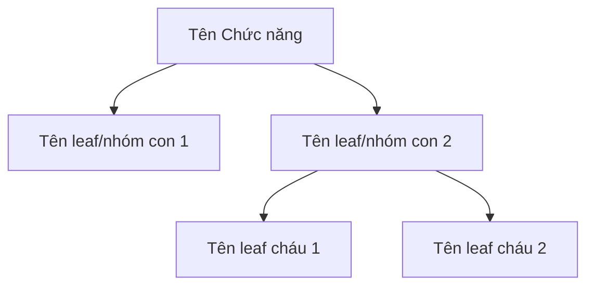
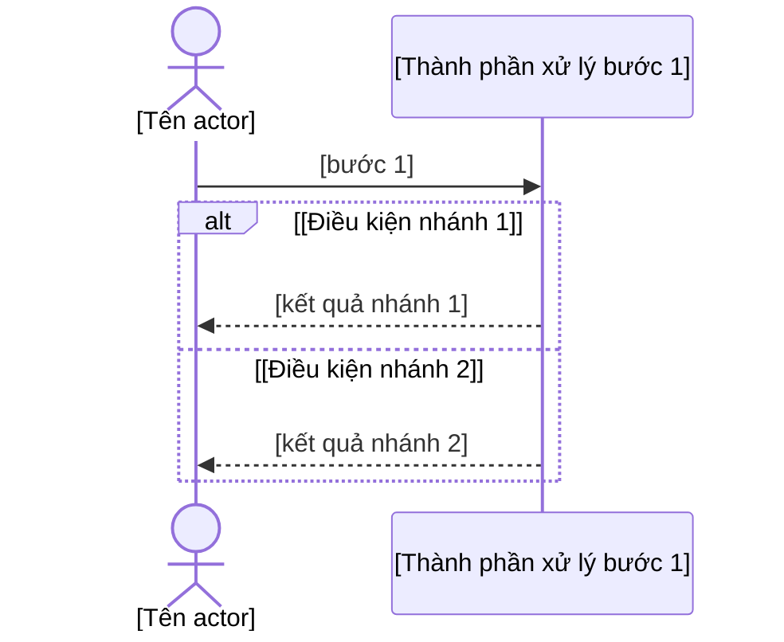

<!-- KHUNG MẶC ĐỊNH — mô phỏng đúng cấu trúc tài liệu ban hành thật của công ty (docx),
     KHÔNG còn khuôn I-VI tự đặt trước đây. 4 cấp lồng nhau:

       ## Nhóm
         ### Chức năng
           #### Sơ đồ chức năng / Mục đích chức năng / Mô tả chức năng
             ##### Tên leaf function list   (LUÔN có — một khối cho MỖI leaf FN-ID con của
                                              Chức năng này, đối chiếu trực tiếp với
                                              functions.json, không nhóm theo màn hình nữa;
                                              FN-ID tương ứng nằm trong comment ẩn
                                              `<!-- FN-leaf: FN-ID -->` ngay dưới, không lộ
                                              ra ngoài tiêu đề)
               ###### a.-h.  (8 mục cố định, LUÔN ở cấp `######`; nội dung là của MÀN HÌNH
                              thật hiện thực leaf đó — 2 leaf cùng chung 1 màn hình thì lặp
                              nguyên vẹn cùng nội dung a.-h. ở cả 2 khối `#####`)

     Số thứ tự (1./2.1./a.-h.) tính theo VỊ TRÍ xuất hiện khi ghi, không lưu cố định — xem
     hướng dẫn đánh số ở srs-from-code.md. Khung này (file mẫu) không tự đánh số, vì đây
     chỉ là một Nhóm/Chức năng mẫu duy nhất, không phải toàn tài liệu.

     `<!-- FN: FN-ID, FN-ID... -->` đặt ngay dưới heading Chức năng — comment ẩn, KHÔNG
     hiện khi xem markdown/xuất Word, chỉ srs_verify.py đọc để đối chiếu functions.json.
     Đây là cổng BLOCKING duy nhất còn lại — mọi FN trong phạm vi phải có mặt ở ít nhất
     một comment.

     Không để sót placeholder [...]: điền, hoặc dùng đúng placeholder cố định
     "_(cần chèn ảnh — không tự sinh)_" cho mục f (không phải placeholder ngoặc vuông,
     srs_verify.py không coi cụm này là placeholder chưa điền).

     Tài liệu này GIAO KHÁCH — không nêu file:dòng, tên class/hàm, đường dẫn mã nguồn.
     Bằng chứng file:dòng ở lại intel.md cùng thư mục. -->

## [Tên Nhóm]

<!-- TODO 3B-4: Sơ đồ các giao thức kết nối giữa các khối, Cơ sở dữ liệu — chưa tự sinh, cần đợt sau -->

### [Tên Chức năng]

<!-- FN: [FN-ID, FN-ID...] -->

#### Sơ đồ chức năng

<!-- KHÔNG phải sơ đồ luồng nghiệp vụ — đây là CÂY TÊN chức năng con, dựng thẳng từ cấu
     trúc `functions.json` (không phải intel §5). Node gốc = tên Chức năng (chính khối
     `###` đang viết); node con = tên từng leaf/nhóm con trực tiếp trong subtree
     `functions.json` của Chức năng này, đệ quy đúng số cấp đang có (lấy trường "name",
     bỏ dấu gạch đầu dòng "- "/"+ " và dấu chấm cuối câu) — CHỈ nối tên với tên bằng mũi
     tên xuống, không thêm bước xử lý/điều kiện/động từ nào (không phải flowchart tiến
     trình, không có node hình thoi quyết định). Luôn dựng được (nguồn là functions.json,
     không phụ thuộc intel.md có luồng hay không) — không có case "không có dữ liệu" để
     xoá khối này. -->

#### Mục đích chức năng

[1 câu, văn phong Hán-Việt trang trọng nêu giá trị/lý do nghiệp vụ — không mô tả thao tác.]

#### Mô tả chức năng

##### Tên leaf function list

<!-- FN-leaf: FN-01-XX-XX-XX -->

<!-- Heading "##### Tên leaf" LUÔN có mặt — một khối cho MỖI leaf FN-ID con trực tiếp của
     Chức năng này (đối chiếu functions.json), không còn điều kiện ≥2 màn hình. Tên lấy từ
     trường "name" của leaf trong functions.json, bỏ dấu gạch đầu dòng "- "/"+ " và dấu
     chấm cuối câu — KHÔNG đưa mã FN-ID vào tiêu đề (tài liệu giao khách không lộ mã nội
     bộ); mã FN-ID để riêng trong comment ẩn `<!-- FN-leaf: ... -->` ngay dưới heading, chỉ
     phục vụ đối chiếu/công cụ, không hiện khi xem markdown/xuất Word. Nội dung a.-h. bên
     dưới là của MÀN HÌNH THẬT hiện thực leaf này (theo intel §2/§11/§12) — 2 leaf khác
     nhau cùng chung một màn hình thì LẶP NGUYÊN VẸN toàn bộ a.-h. (kể cả bảng g., mọi bảng
     UC ở d.) ở cả 2 khối `#####`, không cắt gọn theo riêng từng leaf. -->

###### a. Đối tượng tham gia

<!-- Dòng gạch đầu dòng ("- "), đúng như tài liệu ban hành thật — kể cả khi chỉ có một
     dòng duy nhất liệt kê nhiều vai trò cách nhau bằng dấu phẩy. -->

- [Vai trò/đối tượng tham gia màn hình này.]

###### b. Điều kiện thực hiện

<!-- Dòng gạch đầu dòng ("- "), cùng quy ước với mục a. -->

- [Điều kiện để truy cập/thực hiện màn hình này.]

###### c. Mô hình Usecase

<!-- mermaid flowchart mô phỏng actor-usecase (mermaid không có UML use-case native),
     dựng từ intel §12 (trường Người dùng -> actor, Tên Use Case -> use case). Không có
     dữ liệu -> xoá cả khối mermaid. -->

###### d. Kịch bản trường hợp sử dụng

<!-- TOÀN BỘ 9 field nằm trong MỘT bảng HTML thô (không dùng cú pháp `|...|` — GFM thuần
     không có colspan nên không merge được 1 hàng thành full-width). 4 field đầu (Tên Use
     Case/Mức quan trọng/Người dùng/Loại UC) là bảng 2 cột thật; 5 field còn lại (Người sử
     dụng và yêu cầu/Mô tả tóm tắt/Thời điểm sử dụng/Luồng sự kiện chuẩn/Luồng sự kiện nhỏ)
     mỗi field một hàng `colspan="2"` — mô phỏng đúng layout bảng của tài liệu ban hành
     thật (không còn cột trống thừa). Nhãn IN ĐẬM (`<b>`) đầu mỗi ô. KHÔNG xuống dòng trắng
     bên trong khối `<table>...</table>` (dòng trắng làm hỏng parser HTML thô).

     `Luồng sự kiện chuẩn`/`Luồng sự kiện nhỏ` dùng LIST HTML LỒNG NHAU thật (`<ol>`/`<li>`,
     `
`) để có thụt lề thật khi xuất Word — KHÔNG nối phẳng
     bằng ` ` (mất hết thụt lề, giống lỗi đã gặp). Nhánh `S-n` được nhắc tới NGAY TRONG
     bước của `Luồng sự kiện chuẩn` thì thụt lề lồng trong `<li>` của bước đó (như mẫu dưới:
     `S-1` lồng trong bước 2). `Luồng sự kiện nhỏ` khai triển lại đúng các `S-n` đó, mỗi
     `S-n` một khối thụt lề, bên trong là `<ol>` các bước con của riêng nhánh đó. -->

<table>
<tr><td><b>Tên Use Case:</b> [...]</td><td><b>Mức quan trọng:</b> Chưa có thông tin</td></tr>
<tr><td><b>Người dùng:</b> [...]</td><td><b>Loại UC:</b> Chưa có thông tin</td></tr>
<tr><td colspan="2"><b>Người sử dụng và yêu cầu:</b> [...]</td></tr>
<tr><td colspan="2"><b>Mô tả tóm tắt:</b> [...]</td></tr>
<tr><td colspan="2"><b>Thời điểm sử dụng:</b> Chưa có thông tin</td></tr>
<tr><td colspan="2"><b>Luồng sự kiện chuẩn:</b>
<ol>
<li>[bước 1]</li>
<li>[bước 2]

S-1: "[tên nhánh]"

</li>
</ol>
</td></tr>
<tr><td colspan="2"><b>Luồng sự kiện nhỏ:</b>

S-1: "[tên nhánh]"
<ol>
<li>[bước con]</li>
</ol>

</td></tr>
</table>

###### e. Thiết kế mô hình nghiệp vụ

<!-- mermaid sequenceDiagram (không phải flowchart) chi tiết luồng riêng màn hình này,
     mô phỏng UML sequence diagram có swimlane của tài liệu ban hành thật. Participant =
     đúng thành phần intel §5 nêu tên cho luồng này (vd Web UI/Backend/Database/dịch vụ
     ngoài...) — §5 không nêu tên thành phần nào thì tự suy hợp lý theo bước xử lý, không
     bịa thêm thành phần §5 không nhắc tới. actor luôn là người dùng/vai trò thực hiện
     (không phải hệ thống). Nhánh điều kiện (vd "hợp lệ"/"không hợp lệ") dùng alt/else.
     Không có dữ liệu -> xoá cả khối mermaid. -->

###### f. Thiết kế UX/UI

_(cần chèn ảnh — không tự sinh)_

###### g. Mô tả điều khiển

<!-- Cột "Tên điều khiển" IN ĐẬM cả ô (`**[Loại] "[nhãn]"**`) — mô phỏng đúng tài liệu ban
     hành thật. Cột "Mô tả điều khiển" giữ văn xuôi thường, không in đậm. -->

| Tên điều khiển | Mô tả điều khiển |
| --- | --- |
| **[Loại] "[nhãn]"** | [hình thức + vị trí hiển thị. Ràng buộc ngắn gọn nếu có. Hành vi/mục đích khi tương tác.] |

###### h. Yêu cầu nghiệp vụ

<!-- CÓ quy tắc thật -> danh sách gạch đầu dòng ("- "), MỖI quy tắc/ràng buộc một dòng
     riêng — không viết thành đoạn văn nhiều câu gộp lại. Mỗi dòng vẫn giữ câu ghép điều
     kiện → kết quả.
     KHÔNG có gì để ghi (mục thật sự rỗng, hoặc ca "chưa tìm thấy code") -> giữ PLAIN
     SENTENCE, KHÔNG thêm dấu "- " — viết đúng nguyên văn "Chưa có thông tin." hoặc "Chưa
     tìm thấy hiện thực trong mã nguồn." như mọi mục a.-g. khác. srs_verify.py nhận diện
     mục rỗng bằng khớp NGUYÊN VĂN chuỗi này (không có "- " ở đầu) — thêm dấu gạch đầu dòng
     vào câu rỗng làm cổng kiểm rỗng-ruột không nhận ra được nữa. -->

- [Câu ghép điều kiện → kết quả — "Khi người dùng ..., hệ thống ..., đồng thời ...".]
- [Câu ghép điều kiện → kết quả khác, nếu có nhiều quy tắc.]
