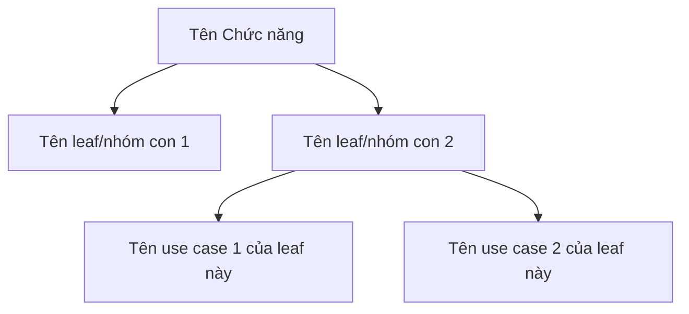
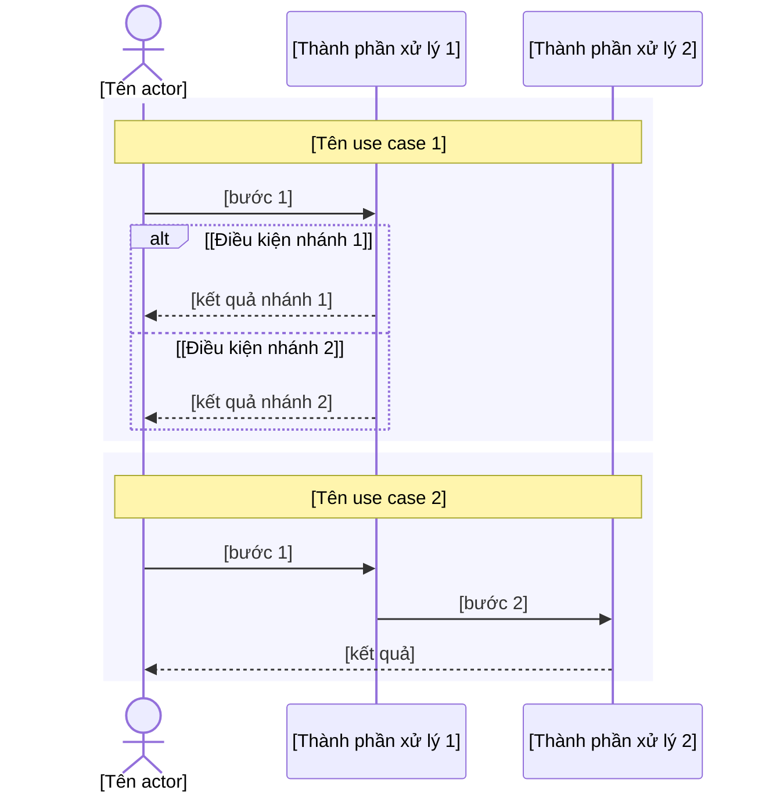

<!-- KHUNG MẶC ĐỊNH — mô phỏng đúng cấu trúc tài liệu ban hành thật của công ty (docx),
     KHÔNG còn khuôn I-VI tự đặt trước đây. 4 cấp lồng nhau:

       ## Nhóm
         ### Chức năng
           #### Sơ đồ chức năng / Mục đích chức năng / Mô tả chức năng
             ##### Tên leaf function list   (LUÔN có — một khối cho MỖI leaf FN-ID trong
                                              TOÀN BỘ subtree functions.json của Chức năng
                                              này, bất kể sâu mấy cấp, không nhóm theo màn
                                              hình nữa; FN-ID tương ứng nằm trong comment ẩn
                                              "FN-leaf: FN-ID" ngay dưới, không lộ ra ngoài
                                              tiêu đề — xem cú pháp thật ở dòng comment thật
                                              bên dưới heading mẫu)
               ###### a.-g.  (7 mục cố định, LUÔN ở cấp `######`; nội dung là của MÀN HÌNH
                              thật hiện thực leaf đó — 2 leaf cùng chung 1 màn hình thì lặp
                              nguyên vẹn cùng nội dung a.-g. ở cả 2 khối `#####`.
                              CỐ Ý LỆCH docx gốc: docx tách "Thiết kế UX/UI" (f.) và
                              "Mô tả điều khiển" (g.) thành 2 mục, khung này GỘP làm một
                              mục `f.` để ảnh và bảng điều khiển của cùng một màn nằm
                              cạnh nhau, "Yêu cầu nghiệp vụ" lùi từ h. xuống g.)

     Số thứ tự (1./2.1./a.-g.) tính theo VỊ TRÍ xuất hiện khi ghi, không lưu cố định — xem
     hướng dẫn đánh số ở srs-from-code.md. Khung này (file mẫu) không tự đánh số, vì đây
     chỉ là một Nhóm/Chức năng mẫu duy nhất, không phải toàn tài liệu.

     Comment ẩn "FN: FN-ID, FN-ID..." đặt ngay dưới heading `### [Tên Chức năng]` (cú pháp
     thật ở dòng comment ngay dưới heading Chức năng mẫu bên dưới) — KHÔNG hiện khi xem
     markdown/xuất Word, chỉ srs_verify.py đọc để đối chiếu functions.json. Đây là một
     trong các cổng BLOCKING — mọi FN trong phạm vi phải có mặt ở ít nhất một comment
     "FN: ...", VÀ mỗi khối `#####` phải có đúng một comment "FN-leaf: ..." khớp đúng leaf
     đang viết (cổng BLOCKING riêng, xem srs-from-code.md bước 8-9).

     Không để sót placeholder [...]: điền, hoặc dùng đúng placeholder cố định
     "_(cần chèn ảnh — không tự sinh)_" cho mục f (không phải placeholder ngoặc vuông,
     srs_verify.py không coi cụm này là placeholder chưa điền).

     Tài liệu này GIAO KHÁCH — không nêu file:dòng, tên class/hàm, đường dẫn mã nguồn.
     Bằng chứng file:dòng ở lại intel.md cùng thư mục. -->

## [Tên Nhóm]

<!-- TODO 3B-4: Sơ đồ các giao thức kết nối giữa các khối, Cơ sở dữ liệu — chưa tự sinh, cần đợt sau -->

### [Tên Chức năng]

<!-- FN: [FN-ID, FN-ID...] -->

#### Sơ đồ chức năng

<!-- KHÔNG phải sơ đồ luồng nghiệp vụ — đây là CÂY TÊN chức năng con. Node gốc = tên Chức
     năng (chính khối `###` đang viết). CHỈ nối tên với tên bằng mũi tên xuống, không thêm
     bước xử lý/điều kiện/động từ nào (không phải flowchart tiến trình, không có node hình
     thoi quyết định).

     NODE CON PHẢI PHỦ ĐÚNG NHỮNG GÌ "Mô tả chức năng" BÊN DƯỚI THẬT SỰ CÓ — sơ đồ một
     node trơ trọi trong khi phần dưới đặc tả 6 use case là SAI (lỗi đã gặp thật). Lấy
     node con theo thứ tự ưu tiên:
       1. `functions.json` có node con trong subtree Chức năng này -> dùng đúng tên các
          node đó (trường "name", bỏ dấu gạch đầu dòng "- "/"+ " và dấu chấm cuối câu),
          đệ quy đủ số cấp đang có.
       2. `functions.json` KHÔNG có node con (Chức năng chính là một leaf) -> node con =
          tên các use case thật sự viết ở mục `d.` của (các) khối `#####` bên dưới.
     Hai nguồn cùng có thì vẽ cả hai cấp: leaf functions.json ở cấp 1, use case của leaf
     đó ở cấp 2. Luôn dựng được — không có case "không có dữ liệu" để xoá khối này. -->

#### Mục đích chức năng

[1 câu, văn phong Hán-Việt trang trọng nêu giá trị/lý do nghiệp vụ — không mô tả thao tác.]

#### Mô tả chức năng

##### Tên leaf function list

<!-- FN-leaf: FN-01-XX-XX-XX -->

<!-- Heading "##### Tên leaf" LUÔN có mặt — một khối cho MỖI leaf FN-ID trong TOÀN BỘ
     subtree functions.json của Chức năng này (bất kể sâu mấy cấp), không còn nhóm theo
     màn hình. Tên lấy từ trường "name" của leaf trong functions.json, bỏ dấu gạch đầu
     dòng "- "/"+ " và dấu chấm cuối câu — KHÔNG đưa mã FN-ID vào tiêu đề (tài liệu giao
     khách không lộ mã nội bộ); mã FN-ID để riêng trong comment ẩn "FN-leaf: ..." ngay dưới
     heading (cú pháp thật ở dòng comment ngay trên đoạn giải thích này), chỉ phục vụ đối
     chiếu/công cụ, không hiện khi xem markdown/xuất Word — ĐÂY LÀ CỔNG BLOCKING, thiếu
     hoặc sai một comment "FN-leaf" là srs_verify.py chặn báo xong (xem srs-from-code.md
     bước 8-9). Leaf không ánh xạ được sang màn hình riêng nào (hành động là một nút/thao
     tác trên màn hình khác) → lấy nội dung a.-g. của màn hình chứa hành động đó, nêu rõ ở
     mục b.; leaf hoàn toàn chưa tìm thấy code → theo đúng luật "chưa tìm thấy hiện thực"
     ở bước 8. Nội dung a.-g. bên dưới là của MÀN HÌNH THẬT hiện thực leaf này (theo intel
     §2/§11/§12) — 2 leaf khác nhau cùng chung một màn hình thì LẶP NGUYÊN VẸN toàn bộ
     a.-g. (kể cả bảng điều khiển trong f., mọi bảng UC ở d.) ở cả 2 khối `#####`, không cắt gọn theo riêng
     từng leaf. -->

###### a. Đối tượng tham gia

<!-- Dòng gạch đầu dòng ("- "), đúng như tài liệu ban hành thật — kể cả khi chỉ có một
     dòng duy nhất liệt kê nhiều vai trò cách nhau bằng dấu phẩy. -->

- [Vai trò/đối tượng tham gia màn hình này.]

###### b. Điều kiện thực hiện

<!-- Dòng gạch đầu dòng ("- "), cùng quy ước với mục a. -->

- [Điều kiện để truy cập/thực hiện màn hình này.]

###### c. Mô hình Usecase

<!-- mermaid flowchart mô phỏng actor-usecase (mermaid không có UML use-case native),
     dựng từ intel §12 (trường Người dùng -> actor, Tên Use Case -> use case). Không có
     dữ liệu -> xoá cả khối mermaid. -->

###### d. Kịch bản trường hợp sử dụng

<!-- TOÀN BỘ 9 field nằm trong MỘT bảng HTML thô (không dùng cú pháp `|...|` — GFM thuần
     không có colspan nên không merge được 1 hàng thành full-width). 4 field đầu (Tên Use
     Case/Mức quan trọng/Người dùng/Loại UC) là bảng 2 cột thật; 5 field còn lại (Người sử
     dụng và yêu cầu/Mô tả tóm tắt/Thời điểm sử dụng/Luồng sự kiện chuẩn/Luồng sự kiện nhỏ)
     mỗi field một hàng `colspan="2"` — mô phỏng đúng layout bảng của tài liệu ban hành
     thật (không còn cột trống thừa). Nhãn IN ĐẬM (`<b>`) đầu mỗi ô. KHÔNG xuống dòng trắng
     bên trong khối `<table>...</table>` (dòng trắng làm hỏng parser HTML thô).

     `Luồng sự kiện chuẩn`/`Luồng sự kiện nhỏ` dùng LIST HTML LỒNG NHAU thật (`<ol>`/`<li>`,
     `
`) để có thụt lề thật khi xuất Word — KHÔNG nối phẳng
     bằng ` ` (mất hết thụt lề, giống lỗi đã gặp). Nhánh `S-n` được nhắc tới NGAY TRONG
     bước của `Luồng sự kiện chuẩn` thì thụt lề lồng trong `<li>` của bước đó (như mẫu dưới:
     `S-1` lồng trong bước 2). `Luồng sự kiện nhỏ` khai triển lại đúng các `S-n` đó, mỗi
     `S-n` một khối thụt lề, bên trong là `<ol>` các bước con của riêng nhánh đó. -->

<table>
<tr><td><b>Tên Use Case:</b> [...]</td><td><b>Mức quan trọng:</b> Chưa có thông tin</td></tr>
<tr><td><b>Người dùng:</b> [...]</td><td><b>Loại UC:</b> Chưa có thông tin</td></tr>
<tr><td colspan="2"><b>Người sử dụng và yêu cầu:</b> [...]</td></tr>
<tr><td colspan="2"><b>Mô tả tóm tắt:</b> [...]</td></tr>
<tr><td colspan="2"><b>Thời điểm sử dụng:</b> Chưa có thông tin</td></tr>
<tr><td colspan="2"><b>Luồng sự kiện chuẩn:</b>
<ol>
<li>[bước 1]</li>
<li>[bước 2]

S-1: "[tên nhánh]"

</li>
</ol>
</td></tr>
<tr><td colspan="2"><b>Luồng sự kiện nhỏ:</b>

S-1: "[tên nhánh]"
<ol>
<li>[bước con]</li>
</ol>

</td></tr>
</table>

###### e. Thiết kế mô hình nghiệp vụ

<!-- ĐÚNG MỘT khối mermaid sequenceDiagram cho cả mục này — KHÔNG tách thành nhiều khối
     mermaid liên tiếp (mỗi khối lặp lại nguyên si danh sách participant, nhìn như nhiều
     sơ đồ rời rạc; lỗi đã gặp thật). Nhiều use case thì vẫn MỘT sơ đồ, mỗi use case bọc
     trong một khối `rect` có `Note over` mang TÊN USE CASE đó làm nhãn — chính là các
     khung chữ nhật phân tách của tài liệu ban hành thật. Khai participant MỘT LẦN ở đầu,
     dùng chung cho mọi khối `rect`.

     Mô phỏng UML sequence diagram có swimlane. Participant = đúng thành phần intel §5 nêu
     tên cho luồng này (vd Web UI/Backend/Database/dịch vụ ngoài...) — §5 không nêu tên
     thành phần nào thì tự suy hợp lý theo bước xử lý, không bịa thêm thành phần §5 không
     nhắc tới. actor luôn là người dùng/vai trò thực hiện (không phải hệ thống). Nhánh
     điều kiện (vd "hợp lệ"/"không hợp lệ") dùng alt/else BÊN TRONG `rect` của use case
     tương ứng. Không có dữ liệu -> xoá cả khối mermaid. -->

###### f. Thiết kế UX/UI và Mô tả điều khiển

<!-- GỘP hai mục f./g. của docx ban hành làm MỘT (cố ý lệch khuôn docx gốc, theo phản ánh
     người đọc): tách rời thì phải xem hết ảnh màn của mọi use case rồi mới tới bảng điều
     khiển, rất bất tiện. Gộp lại: ảnh của use case này rồi NGAY bảng điều khiển của chính
     use case đó.

     CHIA THEO TỪNG USE CASE — mỗi use case ở mục `d.` là MỘT đầu mục lớn `**[Tên use
     case]**` ở đây, bên dưới nó là ảnh của các màn liên quan riêng use case đó rồi tới
     bảng điều khiển riêng của nó. TUYỆT ĐỐI KHÔNG gộp mọi điều khiển của mọi use case vào
     MỘT bảng duy nhất (lỗi đã gặp thật: một bảng 30 dòng trộn lẫn điều khiển của tạo mới,
     sửa, khoá, chuyển đơn vị — không tra được điều khiển nào thuộc thao tác nào).

     Số đầu mục ở đây = số use case ở mục `d.`, cùng tên, cùng thứ tự. Điều khiển dùng
     chung cho nhiều use case (vd nút "Hủy" của mọi hộp thoại) thì lặp lại ở từng use case
     dùng nó, không tách thành một bảng "dùng chung" riêng.

     Ảnh: luôn ghi cố định "_(cần chèn ảnh — không tự sinh)_" (không tự vẽ mockup, không mô
     tả bố cục). Bảng: cột "Tên điều khiển" IN ĐẬM cả ô (`**[Loại] "[nhãn]"**`), cột "Mô tả
     điều khiển" giữ văn xuôi thường, không in đậm. -->

**[Tên use case 1 — trùng tên với bảng UC thứ nhất ở mục d.]**

_(cần chèn ảnh — không tự sinh)_

| Tên điều khiển | Mô tả điều khiển |
| --- | --- |
| **[Loại] "[nhãn]"** | [hình thức + vị trí hiển thị. Ràng buộc ngắn gọn nếu có. Hành vi/mục đích khi tương tác.] |

**[Tên use case 2 — trùng tên với bảng UC thứ hai ở mục d.]**

_(cần chèn ảnh — không tự sinh)_

| Tên điều khiển | Mô tả điều khiển |
| --- | --- |
| **[Loại] "[nhãn]"** | [hình thức + vị trí hiển thị. Ràng buộc ngắn gọn nếu có. Hành vi/mục đích khi tương tác.] |

###### g. Yêu cầu nghiệp vụ

<!-- CÓ quy tắc thật -> danh sách gạch đầu dòng ("- "), MỖI quy tắc một dòng riêng — không
     viết thành đoạn văn nhiều câu gộp lại. Mỗi dòng vẫn giữ câu ghép điều kiện → kết quả.

     CHỈ GHI QUY TẮC QUAN TRỌNG — mục này là NƠI CHỐT NGHIỆP VỤ, không phải bản kê mọi thứ
     code làm. Tiêu chí giữ: quy tắc mà người đọc KHÔNG suy ra được từ quy ước phần mềm
     thông thường, sai thì hậu quả nghiệp vụ thật. Nhắm 5-12 dòng mỗi khối; dài hơn gần
     như chắc chắn đang liệt kê thứ đáng bỏ (bản đã gặp thật: 38 dòng, quá nửa là validate
     và thông báo).

     BỎ (đã có chỗ khác, hoặc hiển nhiên với mọi phần mềm):
       - Ràng buộc định dạng/độ dài từng trường (tối đa N ký tự, đúng định dạng email/số
         điện thoại, mật khẩu phải có chữ hoa/số/ký tự đặc biệt), "trường bắt buộc" ->
         những thứ này ĐÃ nằm ở cột "Mô tả điều khiển" mục f., ghi lại là trùng lặp.
       - Nguyên văn câu thông báo lỗi/thành công.
       - Hành vi CRUD/UI thông thường: đóng hộp thoại sau khi lưu, tải lại danh sách, khoá
         nút khi đang gửi, phân trang/sắp xếp mặc định, độ trễ gõ phím, loại bản ghi đã
         xoá khỏi truy vấn, ghi nhật ký thao tác.

     GIỮ:
       - Quy tắc duy nhất/trùng lặp và phạm vi áp dụng của nó.
       - Phân quyền và phạm vi dữ liệu (ai được thấy/thao tác cái gì).
       - Vòng đời trạng thái và điều kiện chuyển trạng thái.
       - Ràng buộc liên trường/liên thực thể, quy tắc tính toán.
       - Giao dịch/hoàn tác, tính nhất quán giữa các hệ thống.
       - Hành vi TRÁI quy ước thông thường (chỗ người đọc dễ đoán sai).

     Phân vân một quy tắc thuộc "hiển nhiên" hay không -> GIỮ. KHÔNG được dùng cớ "hiển
     nhiên" để bỏ quy tắc có ngưỡng/con số nghiệp vụ, quy tắc phân quyền, hay quy tắc
     trạng thái — ba loại này luôn ở lại dù trông đơn giản.

     KHÔNG có gì để ghi (mục thật sự rỗng, hoặc ca "chưa tìm thấy code") -> giữ PLAIN
     SENTENCE, KHÔNG thêm dấu "- " — viết đúng nguyên văn "Chưa có thông tin." hoặc "Chưa
     tìm thấy hiện thực trong mã nguồn." như mọi mục a.-g. khác. srs_verify.py nhận diện
     mục rỗng bằng khớp NGUYÊN VĂN chuỗi này (không có "- " ở đầu) — thêm dấu gạch đầu dòng
     vào câu rỗng làm cổng kiểm rỗng-ruột không nhận ra được nữa. -->

- [Câu ghép điều kiện → kết quả — "Khi người dùng ..., hệ thống ..., đồng thời ...".]
- [Câu ghép điều kiện → kết quả khác, nếu có nhiều quy tắc.]
